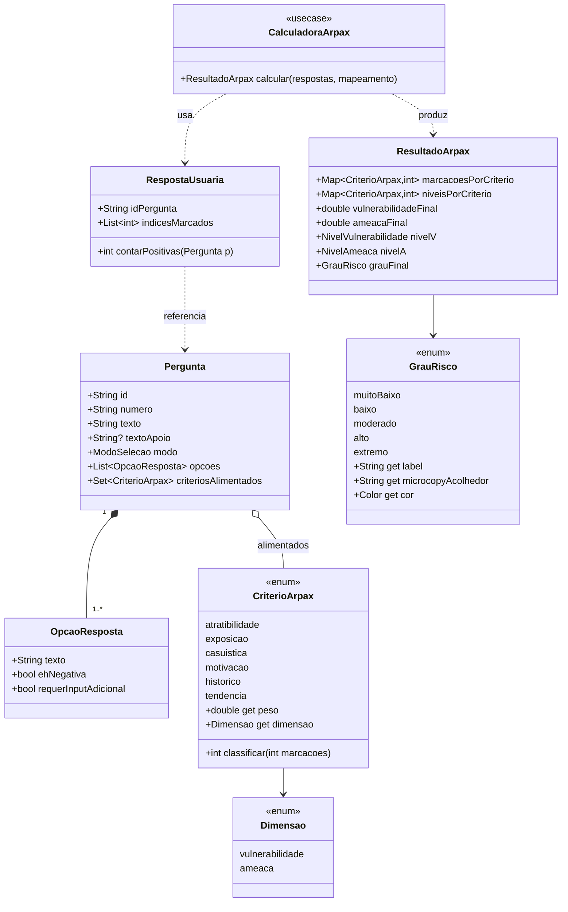
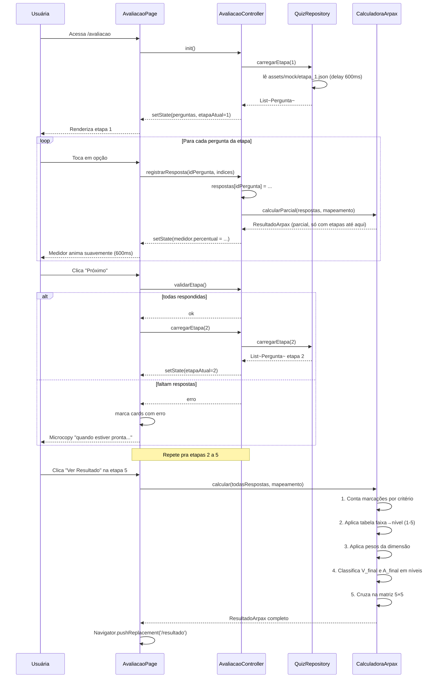
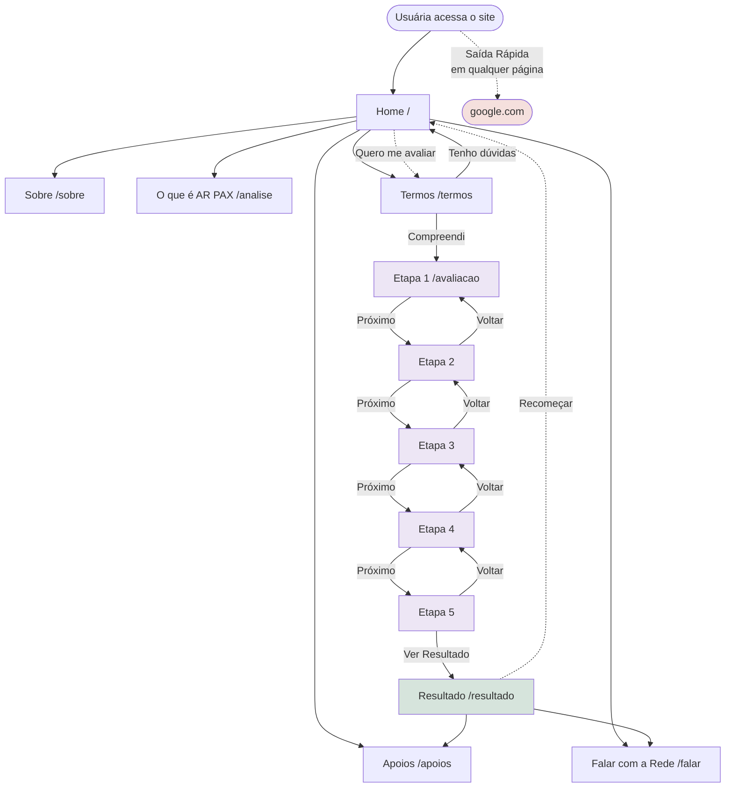
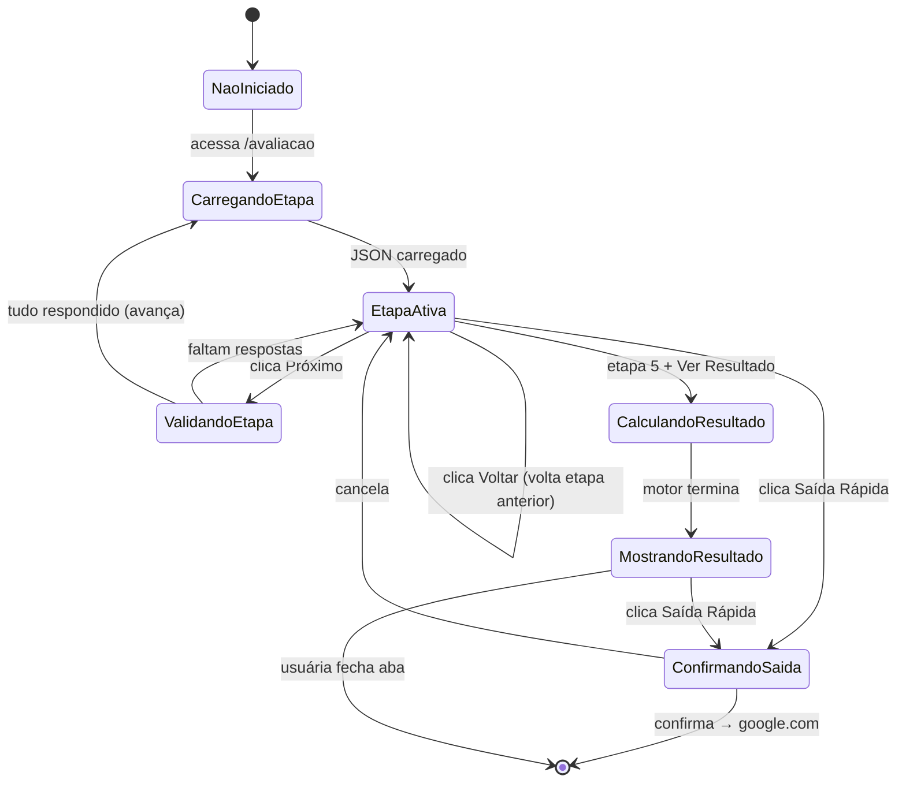
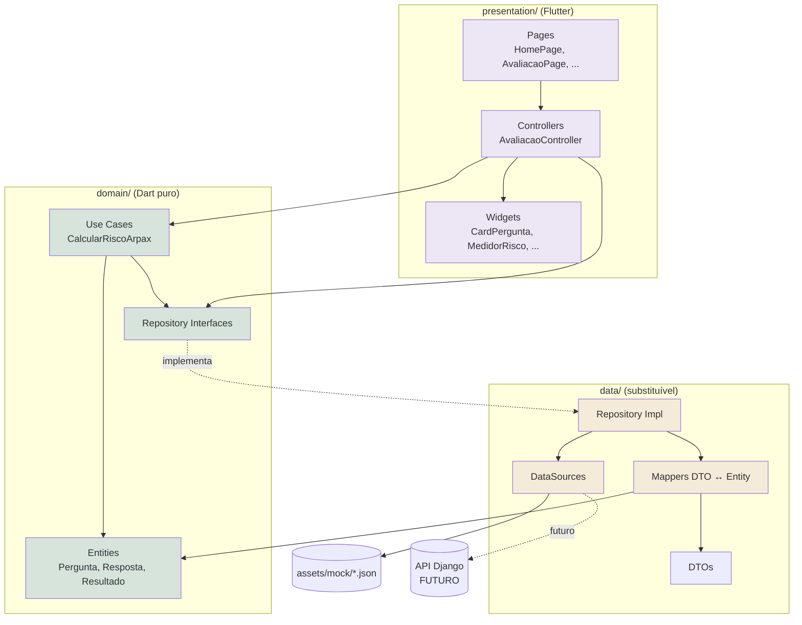

# Planejamento Front-End — Desperte Mulher (Flutter Web)

> **Para quem é este documento:** Codfy (desenvolvedor), Davi (idealizador), Professor avaliador.
> **Linguagem:** simples e didática. Cada decisão explica o **porquê** dela.
> **Prazo de apresentação:** ~36 horas.
> **Ambiente alvo:** Windows 11 + Android Studio Quail (2026.1.1 Patch 2) + Chrome + celular Android via cabo USB.
> **Caminho do projeto:** `C:\dev\projeto_desperte_mulher`

---

## Índice

1. [Resumo executivo (página de apresentação)](#1-resumo-executivo)
2. [Decisões técnicas e os "porquês"](#2-decisões-técnicas)
3. [Stack final](#3-stack-final)
4. [Estrutura de pastas](#4-estrutura-de-pastas)
5. [Identidade visual: paleta, tipografia, microcopy](#5-identidade-visual)
6. [Componentização: catálogo do design system](#6-componentização)
7. [UMLs essenciais](#7-umls-essenciais)
8. [Algoritmo AR PAX traduzido para Dart (validado)](#8-algoritmo-ar-pax)
9. [Mocks da API (JSON)](#9-mocks-da-api)
10. [Funcionalidades de segurança da vítima](#10-segurança-da-vítima)
11. [Acessibilidade e preparação para VLibras](#11-acessibilidade)
12. [Telas que vamos construir (espelhando o site atual)](#12-telas)
13. [Plano de execução das 36 horas](#13-plano-36h)
14. [Configuração do ambiente Windows 11](#14-ambiente)
15. [Roteiro de apresentação para professor e Davi](#15-apresentação)

---

## 1. Resumo executivo

> Use como base do primeiro slide. É o "elevator pitch" técnico.

**O que vamos entregar:** MVP completo do front-end do Desperte Mulher em **Flutter Web**, espelhando todas as páginas do site atual, com qualidade técnica superior, identidade visual nova baseada em psicologia das cores, motor de cálculo AR PAX validado contra a planilha oficial do Scarpelli, e arquitetura preparada para conectar ao backend Django sem reescrita.

**Por que Flutter Web e não outra tecnologia:** porque o time tem familiaridade com Dart (o Silvano já assinou um repositório-template em 13/06/2026), porque permite um único código-fonte, porque o tooling do Android Studio é confortável para o aluno, e porque Flutter Web maduro em 2026 entrega performance e acessibilidade suficientes.

**Por que NÃO empacotamos como app de loja:** porque a vítima não pode ter um ícone "Desperte Mulher" no celular dela — o agressor veria. Web acessada pelo navegador, sem instalar nada, é a única forma segura. **Isso é regra do Silvano Malfatti em reunião.**

**Diferenciais do nosso MVP frente ao site atual em produção:**

- Identidade visual reformulada com base em psicologia das cores para público fragilizado
- **Botão "Saída Rápida"** em todas as páginas (redireciona para o Google em 1 clique + limpa rastros)
- Headers HTTP que pedem ao navegador para não cachear (`Cache-Control: no-store`)
- Validação acessível com **mensagens textuais** + `aria-invalid` (no site atual é só borda vermelha)
- **Perguntas 2, 6 e 14 corrigidas para múltipla escolha** (no site atual estão como radio único — perda grave de dado clínico)
- Microcopy reescrita em tom acolhedor (sem "é indispensável", sem "Mesmo que o Risco seja Baixo, ele Existe!")
- **Motor AR PAX 100% testável**, com 7 cenários cobertos por testes unitários
- Componentes reutilizáveis em um Design System mínimo
- Mobile-first real, áreas de toque ≥48px (excede a recomendação WCAG de 44px)
- Estrutura preparada para VLibras (não implementa agora, mas o slot está pronto)

**O que NÃO entra no MVP** (mas a arquitetura prepara):

- Integração com backend real (Django em construção paralela)
- VLibras integrado (slot preparado no `index.html`)
- Página de Observatório com gráficos e mapa (custo alto, mantém só link externo)
- Sistema Acolhe (área restrita de profissionais)
- Multi-idioma real PT/ES/EN (estrutura preparada, conteúdo só em PT)
- Persistência das respostas em servidor (sigilo da vítima — só RAM)

**Resultado esperado:** um site que a vítima acessa pelo celular em situação de emergência, preenche 27 perguntas com sensação de acolhimento (não interrogatório), recebe feedback visual contínuo do progresso, vê o grau de risco classificado de forma clara, recebe orientação acolhedora sobre próximos passos e tem um botão de "saída rápida" sempre à mão.

---

## 2. Decisões técnicas

Cada decisão abaixo segue o mesmo formato: **o que escolhi**, **por que escolhi**, **o que NÃO escolhi e por quê**.

### 2.1 Flutter Web em vez de Vue/React/Next.js

| Critério | Flutter Web | React/Next.js | Vue |
| --- | :---: | :---: | :---: |
| Time domina Dart | ✅ (Silvano já assinou template) | ❌ curva | ❌ curva |
| Código único mobile/desktop | ✅ | ⚠️ exige CSS pesado | ⚠️ idem |
| Tooling no Win11 + Android Studio | ✅ nativo | ⚠️ é VS Code | ⚠️ idem |
| Build de produção (deploy) | ✅ HTML estático | ✅ | ✅ |
| Performance Web em 2026 | ✅ adequada (com HTML renderer) | ✅ top | ✅ top |

**Conclusão:** Flutter ganha porque está alinhado ao time. Se fosse equipe React, React ganharia. Aqui Flutter ganha.

### 2.2 HTML renderer em vez de CanvasKit

Flutter Web tem dois modos de desenhar:

- **CanvasKit:** desenha pixel a pixel num `<canvas>` (igual videogame). Visualmente lindo, idêntico a app nativo. Mas baixa um motorzinho gráfico de **~2 MB** antes de qualquer coisa aparecer. Texto é pixel — Google **não indexa**, VLibras **não funciona**, leitor de tela **falha**.
- **HTML renderer:** traduz cada widget Flutter em HTML/CSS/SVG comum. Mais leve. Tudo é DOM real — Google indexa, VLibras funciona, leitor de tela funciona, daltonismo é tratado pelo navegador, acessibilidade WCAG funciona de verdade.

**Para o Desperte Mulher, HTML renderer ganha em todas as métricas que importam:**

- Vítima em celular antigo, internet 3G → HTML é muito mais leve
- VLibras (do governo brasileiro) só funciona com DOM real
- SEO importa muito (a vítima precisa achar o site no Google quando estiver em pânico)
- Acessibilidade WCAG AA exige DOM
- O ganho visual "pixel-perfect" do CanvasKit é irrelevante para um site informativo

**Como vamos configurar:** no `web/index.html` que o Flutter gera, dentro da tag `<script>` que carrega o app, adicionar:

```html
<script>
  window.flutterConfiguration = {
    renderer: "html"
  };
</script>
```

E no comando de build:

```bash
flutter build web --web-renderer html --release
```

### 2.3 `setState` puro em vez de Provider/Riverpod/Bloc

| Crítico | setState | Provider | Riverpod | Bloc |
| --- | :---: | :---: | :---: | :---: |
| Curva para o aluno | ✅ zero | ⚠️ baixa | ⚠️ média | ❌ alta |
| Está no template Silvano | ✅ | ❌ | ❌ | ❌ |
| Tamanho do bundle | ✅ menor | ⚠️ pouco maior | ⚠️ pouco maior | ❌ maior |
| Adequado pro escopo (27 perguntas, 1 tela de quiz) | ✅ | ✅ | ⚠️ exagero | ❌ exagero |
| Manutenção em 36 horas | ✅ rápido | ⚠️ ok | ❌ lento | ❌ lento |

**Conclusão:** setState puro. O estado vive principalmente em UMA tela (o quiz) e podemos isolar o motor de cálculo no `domain/`. Não precisamos de máquina de estado distribuída. **Isso replica o estilo do Silvano e facilita avaliação acadêmica.**

> Quando trocaríamos: se o MVP virar produto com muitas telas com estado compartilhado. Mas isso é etapa futura.

### 2.4 Clean Architecture simplificada em vez de MVC tradicional

O Silvano usa `common/Models/Screens` no template — é um MVC implícito. Vamos manter a essência, mas **adicionar uma camada `domain/`** porque:

- O motor AR PAX precisa ser **testável sem Flutter** (testes rápidos sem emulador)
- A lógica do cálculo precisa ser **substituível** quando o backend Django virar fonte de verdade
- Separar "regra de negócio" de "tela" é boa prática profissional que **impressiona em avaliação acadêmica**

**As 3 camadas que vamos usar:**

1. **`presentation/`** — widgets, telas, animações (depende do Flutter)
2. **`domain/`** — entidades + casos de uso (Dart puro, sem Flutter)
3. **`data/`** — fonte de dados (JSON local agora; API real depois)

Regra: cada camada só conhece a de baixo. Tela chama domínio, domínio chama dados.

### 2.5 Mocks em JSON local em vez de API real

- Backend Django em construção paralela (outra frente do projeto)
- Queremos demonstrar o sistema **completo e funcional** em 36h
- JSON é facilmente substituível por `dio.get(...)` no futuro
- Permite testar a camada de cálculo sem rede
- **Confirmado pelo usuário:** "API fake em Dart com delay, modo json mesmo"

### 2.6 Persistência só em RAM em vez de SharedPreferences

- **Sigilo da vítima:** se ela fechar o navegador, nada pode ficar gravado
- O template do Silvano usa `shared_preferences` para login, mas **para o quiz isso é antipattern de segurança**
- Estado do quiz vive enquanto a aba está aberta. Refresh = começa do zero
- A própria UI avisa: "se você fechar essa janela, suas respostas não serão salvas — isso é proteção sua"

### 2.7 Botão Saída Rápida no MVP

- **Confirmado pelo usuário:** entra agora, é crítico
- Implementação minimalista mas funcional desde o primeiro commit
- Toda página tem esse botão no header

### 2.8 Renomear package de `troca_contexto` para `desperte_mulher`

- `troca_contexto` é o nome do template didático do Silvano
- O package real precisa refletir o produto
- Mais profissional para apresentar e para o Davi avaliar

---

## 3. Stack final

### 3.1 Núcleo

| Item | Versão | Justificativa |
| --- | --- | --- |
| **Flutter SDK** | 3.27+ (estável atual) | LTS, suporte completo a Web HTML renderer |
| **Dart SDK** | 3.7+ | Vem com o Flutter |
| **Plataforma alvo** | Web (Chrome / Edge / Safari mobile) | Único alvo do MVP |
| **State management** | `setState` puro | Mantém estilo Silvano, suficiente |
| **Roteamento** | `Navigator` 2.0 + `MaterialApp.routes` | Sem libs externas |
| **Persistência** | nenhuma (RAM apenas) | Sigilo da vítima |
| **HTTP** | nenhum no MVP | Mocks locais |

### 3.2 `pubspec.yaml` proposto

```yaml
name: desperte_mulher
description: "Plataforma de autoavaliação de risco de violência doméstica baseada na metodologia AR PAX."
publish_to: 'none'
version: 0.1.0+1

environment:
  sdk: ^3.7.0

dependencies:
  flutter:
    sdk: flutter
  cupertino_icons: ^1.0.8
  # Sem state management externo (estilo Silvano)
  # Sem dio/http (mocks locais por enquanto)

dev_dependencies:
  flutter_test:
    sdk: flutter
  flutter_lints: ^5.0.0

flutter:
  uses-material-design: true
  assets:
    - assets/mock/
    - assets/images/
    - assets/images/parceiros/
  fonts:
    - family: Lato
      fonts:
        - asset: assets/fonts/Lato-Regular.ttf
        - asset: assets/fonts/Lato-Bold.ttf
          weight: 700
        - asset: assets/fonts/Lato-Italic.ttf
          style: italic
    - family: PlayfairDisplay
      fonts:
        - asset: assets/fonts/PlayfairDisplay-Regular.ttf
        - asset: assets/fonts/PlayfairDisplay-Bold.ttf
          weight: 700
        - asset: assets/fonts/PlayfairDisplay-Italic.ttf
          style: italic
```

### 3.3 O que NÃO usamos

- `provider` / `riverpod` / `bloc` — exagero pro escopo
- `dio` / `http` — não temos backend ainda
- `google_fonts` — fontes embarcadas (carregamento mais rápido)
- `intl` — só PT no MVP
- `shared_preferences` — sigilo
- `image_picker` — não pedimos foto

### 3.4 O que PREPARAMOS sem implementar

- Plugin VLibras (slot reservado no `index.html`)
- Cliente HTTP (`QuizRepository` com interface abstrata; hoje lê JSON, amanhã faz GET)
- Multi-idioma (strings centralizadas em `app_strings.dart`)


---

## 4. Estrutura de pastas

> Cada pasta tem um responsável claro. Quando precisar criar algo novo, primeiro descubra onde ele vive.

```
desperte_mulher/
├── lib/
│   ├── main.dart                              # 5 linhas, só roda a app
│   │
│   ├── common/                                # ⭐ estilo Silvano: utilitários globais
│   │   ├── app_routes.dart                    # constantes de rota
│   │   ├── route_manager.dart                 # factory createMaterialApp()
│   │   ├── app_theme.dart                     # ThemeData único (paleta + tipografia)
│   │   ├── app_strings.dart                   # TODAS as strings em um lugar (i18n futuro)
│   │   ├── app_dimensions.dart                # espaçamentos, raios, breakpoints
│   │   └── app_assets.dart                    # caminhos de PNG/SVG
│   │
│   ├── domain/                                # ⭐ Dart puro, sem Flutter, 100% testável
│   │   ├── entities/
│   │   │   ├── criterio_arpax.dart            # enum 6 critérios + pesos + classificar()
│   │   │   ├── nivel_dimensao.dart            # enum 5 níveis de V e A
│   │   │   ├── grau_risco.dart                # enum MB/BA/MO/AL/EX
│   │   │   ├── pergunta.dart                  # texto + opções + critérios alimentados
│   │   │   ├── opcao_resposta.dart            # texto + se é "negativa" (Não/Não sei)
│   │   │   ├── resposta_usuaria.dart          # idPergunta + índices marcados
│   │   │   └── resultado_arpax.dart           # V_final, A_final, grau, breakdown
│   │   │
│   │   ├── repositories/                      # contratos abstratos
│   │   │   └── quiz_repository.dart           # abstract class QuizRepository
│   │   │
│   │   └── usecases/                          # ⭐ a inteligência do sistema
│   │       ├── calcular_risco_arpax.dart      # ⭐ O MOTOR principal
│   │       ├── classificar_criterio.dart      # marcações → nível 1-5
│   │       ├── aplicar_pesos_dimensao.dart    # 3 níveis + 3 pesos → V_final ou A_final
│   │       ├── classificar_dimensao.dart      # V_final → MB/BA/MED/AL/MA
│   │       └── cruzar_matriz_risco.dart       # matriz 5×5 → grau final
│   │
│   ├── data/                                  # fonte de dados
│   │   ├── datasources/
│   │   │   └── quiz_local_datasource.dart     # lê assets/mock/*.json com delay
│   │   ├── models/                            # DTOs (espelham JSON)
│   │   │   ├── pergunta_dto.dart
│   │   │   └── etapa_dto.dart
│   │   ├── mappers/
│   │   │   └── pergunta_mapper.dart           # DTO ↔ Entity
│   │   └── repositories/
│   │       └── quiz_repository_impl.dart      # implementação concreta
│   │
│   ├── presentation/                          # Flutter mora aqui
│   │   ├── pages/                             # uma pasta por tela
│   │   │   ├── home/home_page.dart
│   │   │   ├── sobre/sobre_page.dart
│   │   │   ├── analise/analise_page.dart      # "O que é AR PAX"
│   │   │   ├── apoios/apoios_page.dart
│   │   │   ├── termos/termos_page.dart
│   │   │   ├── falar/falar_page.dart          # telefones da rede
│   │   │   ├── avaliacao/
│   │   │   │   ├── avaliacao_page.dart        # container do stepper
│   │   │   │   ├── etapa_widget.dart          # widget genérico de etapa
│   │   │   │   └── controller/
│   │   │   │       └── avaliacao_controller.dart  # estado em RAM (setState)
│   │   │   ├── resultado/resultado_page.dart
│   │   │   └── nao_encontrada/nao_encontrada_page.dart  # 404
│   │   │
│   │   └── widgets/                           # ⭐ Design System
│   │       ├── botoes/
│   │       │   ├── botao_primario.dart
│   │       │   ├── botao_secundario.dart
│   │       │   ├── botao_texto.dart
│   │       │   └── botao_saida_rapida.dart
│   │       ├── cards/
│   │       │   ├── card_pergunta.dart         # ⭐ baseado no OptionCard do Silvano
│   │       │   ├── card_apoiador.dart
│   │       │   └── card_resultado.dart
│   │       ├── feedback/
│   │       │   ├── medidor_risco.dart         # ⭐ barra animada continuamente
│   │       │   ├── progresso_etapas.dart      # 5 círculos + linhas
│   │       │   └── badge_seguranca.dart       # chip "100% anônimo"
│   │       ├── layout/
│   │       │   ├── header_app.dart            # com botão saída rápida
│   │       │   ├── footer_app.dart            # telefones de emergência
│   │       │   ├── scaffold_acolhedor.dart    # base de toda página
│   │       │   └── responsive_builder.dart    # helper mobile/tablet/desktop
│   │       ├── textos/
│   │       │   ├── titulo_h1.dart
│   │       │   ├── titulo_h2.dart
│   │       │   ├── paragrafo.dart
│   │       │   └── texto_apoio.dart
│   │       └── seguranca/
│   │           ├── aviso_historico_modal.dart # "use aba anônima" no primeiro acesso
│   │           └── confirmacao_saida_modal.dart
│   │
│   └── web/                                   # ajustes específicos web
│       └── browser_helpers.dart               # window.location, limpa histórico
│
├── assets/
│   ├── mock/
│   │   ├── etapa_1.json                       # perguntas 1-5
│   │   ├── etapa_2.json                       # perguntas 6, 7.a, 7.b, 8-12
│   │   ├── etapa_3.json                       # perguntas 13-16
│   │   ├── etapa_4.json                       # perguntas 17-21
│   │   ├── etapa_5.json                       # perguntas 22-27
│   │   └── mapeamento_criterios.json          # ⭐ pergunta × critério (a tabela FRIDA)
│   ├── images/
│   │   ├── logo_desperte_mulher.png           # do Davi (PENDENTE)
│   │   ├── logo_desperte_mulher_placeholder.png  # nosso provisório
│   │   ├── parceiros/
│   │   │   ├── cnj.png
│   │   │   ├── cnmp.png
│   │   │   ├── catolica.png
│   │   │   └── ... (todos os outros)
│   │   └── ilustracoes/                       # ícones/SVGs decorativos
│   └── fonts/
│       ├── Lato-Regular.ttf
│       ├── Lato-Bold.ttf
│       ├── Lato-Italic.ttf
│       ├── PlayfairDisplay-Regular.ttf
│       ├── PlayfairDisplay-Bold.ttf
│       └── PlayfairDisplay-Italic.ttf
│
├── test/
│   ├── domain/
│   │   ├── calcular_risco_arpax_test.dart     # ⭐ 7 cenários obrigatórios
│   │   ├── classificar_criterio_test.dart     # 30 casos de borda
│   │   └── cruzar_matriz_risco_test.dart      # todos os 25 cruzamentos
│   └── presentation/
│       └── card_pergunta_test.dart            # widget test básico
│
├── web/
│   ├── index.html                             # ⭐ com config HTML renderer + meta tags
│   ├── manifest.json                          # PWA mínimo (sem ícone agressivo)
│   ├── favicon.png                            # neutro (não denuncia)
│   └── icons/
│
├── pubspec.yaml
├── analysis_options.yaml
└── README.md
```

### 4.1 O "porquê" de cada pasta

- **`common/`** — copiado do estilo Silvano. **`app_strings.dart` é essencial**: todas as frases do app em um único arquivo. Facilita revisão de microcopy E prepara multi-idioma futuro com troca mínima.
- **`domain/`** — coração do sistema. Sem dependência Flutter, roda `dart test` em milissegundos. Quando o Felipe Scarpelli pedir "muda peso da Casuística pra 1/5", troca em UM lugar.
- **`data/`** — onde "buscamos" dados. Hoje lê JSON local com `await Future.delayed(Duration(milliseconds: 600))` simulando latência. Amanhã pode fazer `dio.get(...)`. **A camada que usa nunca sabe a diferença.**
- **`presentation/`** — onde fica Flutter. Quanto mais "burra" essa camada, melhor.
- **`presentation/widgets/`** — Design System. Quando precisar de botão novo, NÃO crio do zero — uso `BotaoPrimario`.
- **`assets/mock/`** — JSON com as perguntas e o mapeamento. Estrutura espelha o que o backend Django vai devolver.
- **`test/`** — testes automatizados. Os testes do `domain/` são **obrigatórios** porque validam que o cálculo está matematicamente correto.

### 4.2 Convenções de nomenclatura

| Tipo | Padrão | Exemplo |
| --- | --- | --- |
| Arquivos Dart | `snake_case.dart` | `card_pergunta.dart` |
| Classes | `PascalCase` | `class CardPergunta extends StatefulWidget` |
| Variáveis/funções | `camelCase` | `void onPerguntaRespondida()` |
| Constantes | `lowerCamelCase` | `static const corPrimaria = ...` |
| Métodos privados | `_` no início | `void _validarEntrada()` |
| Enums | `PascalCase` tipo, `lowerCamelCase` valores | `enum CriterioArpax { atratibilidade, ... }` |
| Pastas | `snake_case` minúsculo | `presentation/widgets/cards/` |

> Diferença vs Silvano: ele usa `Models/` e `Screens/` PascalCase (não convencional Dart). Vou usar minúsculo conforme padrão oficial. Se ele exigir, mudamos.

### 4.3 Regra de import absoluto

Em vez de fazer `import '../../../common/app_theme.dart'` (frágil), usamos imports do package:

```dart
import 'package:desperte_mulher/common/app_theme.dart';
import 'package:desperte_mulher/domain/entities/pergunta.dart';
```

Isso é o padrão profissional Dart. Quebra menos quando você move arquivos.

---

## 5. Identidade visual

### 5.1 Princípios de design (resumo de uma frase cada)

1. **Acolhimento sobre alerta.** Nada na tela "grita" com a usuária.
2. **Minimalismo funcional.** Cada pixel justifica sua presença.
3. **Hierarquia clara.** A usuária sempre sabe o que é mais importante.
4. **Espaço para respirar.** Padding generoso, texto não amontoado.
5. **Feedback sem bombardeio.** Microinterações discretas, animações curtas (≤300ms).

### 5.2 Paleta final justificada por psicologia da cor

> **Base científica:** estados emocionais fragilizados respondem mal a cores ativadoras (vermelhos saturados → estresse simpático), cores frias profundas (azul-marinho → distanciamento) e cores excitantes (amarelo neon → ansiedade). Respondem bem a tons quebrados, levemente acinzentados, com nuance — que comunicam "casa", "cuidado", "natureza".

**Paleta escolhida: "Lavanda Acolhedora"** (variação da que propus no chat anterior)

```dart
// lib/common/app_theme.dart

class AppCores {
  AppCores._();
  
  // === PRIMÁRIA: Lavanda Acolhedora ===
  // Substitui o rosa #C2527A do site atual (que era ok mas muito saturado)
  static const primaria        = Color(0xFF8B6F9E);  // lavanda profunda
  static const primariaClara   = Color(0xFFB89BC9);  // lavanda suave (hover discreto)
  static const primariaEscura  = Color(0xFF6B5278);  // lavanda intensa (pressionado)
  static const primariaFundo   = Color(0xFFEDE6F5);  // lavanda diluída (badges, chips)
  
  // === SECUNDÁRIA: Rosa Empoeirado ===
  static const secundaria      = Color(0xFFC99D9A);  // rosa empoeirado (não rosa Barbie)
  static const secundariaClara = Color(0xFFE8D0CE);  // rosa fundo de seção
  
  // === TERCIÁRIA: Verde Sálvia (sucesso, "tudo certo") ===
  static const terciaria       = Color(0xFF8AA89B);  // verde-sálvia
  static const terciariaClara  = Color(0xFFD6E4DC);  // verde diluído
  
  // === NEUTROS (fundo, texto) ===
  static const fundo               = Color(0xFFFBF8F4);  // off-white quente (NUNCA branco puro #FFF)
  static const fundoCard           = Color(0xFFFFFFFF);  // branco puro só pra destacar cards
  static const fundoSecundario     = Color(0xFFF2EBE3);  // bege para alternar seções
  static const divisor             = Color(0xFFE5DDD3);  // bege divisor
  static const textoPrincipal      = Color(0xFF3A3536);  // grafite quente (NUNCA preto puro #000)
  static const textoSecundario     = Color(0xFF6B6164);  // cinza médio quente
  static const textoApagado        = Color(0xFFA09894);  // cinza claro quente
  
  // === FEEDBACK (USADAS COM PARCIMÔNIA) ===
  static const erro          = Color(0xFFB5524D);  // vermelho terracota (NÃO neon)
  static const erroFundo     = Color(0xFFF5E0DD);  // vermelho diluído (background de aviso)
  static const sucesso       = Color(0xFF7A9E8B);
  static const sucessoFundo  = Color(0xFFE0EEE7);
  static const atencao       = Color(0xFFC9A86A);  // âmbar suave (NÃO amarelo neon)
  static const atencaoFundo  = Color(0xFFF5EBD9);
  
  // === GRAUS DE RISCO (TELA DE RESULTADO) ===
  // Gradiente cromático que vai de verde-paz a bordô-maduro
  static const grauMuitoBaixo = Color(0xFF8AA89B);  // verde-sálvia
  static const grauBaixo      = Color(0xFFB8A85F);  // amarelo-mostarda terroso
  static const grauModerado   = Color(0xFFC98A5F);  // terracota suave
  static const grauAlto       = Color(0xFFB56B5F);  // marrom-avermelhado
  static const grauExtremo    = Color(0xFF8B4A47);  // bordô maduro (NUNCA vermelho-sangue)
}
```

**Por que NÃO usamos vermelho neon mesmo em "Extremo":**
Estudos de UX em saúde mental indicam que vermelho-sangue/neon dispara cortisol e pode paralisar a usuária. Bordô maduro comunica gravidade sem disparar pânico. Acompanhamos com **ícone + texto explicativo** (princípio de acessibilidade: cor nunca é o único canal de informação).

**Contraste verificado contra WCAG 2.1 AA:**

| Combinação | Razão | Status |
| --- | --- | --- |
| `textoPrincipal` sobre `fundo` | 14.5:1 | ✅ AAA |
| `primaria` sobre branco | 5.2:1 | ✅ AA normal e AAA grande |
| `textoSecundario` sobre `fundoCard` | 6.4:1 | ✅ AA |
| `erro` sobre `erroFundo` | 5.1:1 | ✅ AA |
| Branco sobre `primaria` | 5.2:1 | ✅ AA |
| Branco sobre `grauExtremo` | 8.1:1 | ✅ AAA |

### 5.3 Tipografia

Mantemos o conceito do site atual (serifa elegante + sans-serif limpa) mas trocamos para um par mais legível em mobile:

- **Lato** (sans-serif) — corpo e UI. Alta legibilidade, suporta acentos PT-BR perfeitamente, gratuita.
- **Playfair Display** (serif) — títulos hero. Humaniza, traz emoção. Itálico elegante para destaques ("liberdade", "Vida").

```dart
// lib/common/app_theme.dart (continuação)

class AppTipografia {
  AppTipografia._();
  
  static const tituloHero = TextStyle(
    fontFamily: 'PlayfairDisplay',
    fontSize: 48,         // mobile escala: 36
    fontWeight: FontWeight.w600,
    height: 1.2,
    letterSpacing: -0.5,
    color: AppCores.textoPrincipal,
  );
  
  static const tituloH1 = TextStyle(
    fontFamily: 'PlayfairDisplay',
    fontSize: 32,         // mobile: 26
    fontWeight: FontWeight.w600,
    height: 1.3,
  );
  
  static const tituloH2 = TextStyle(
    fontFamily: 'Lato',
    fontSize: 24,         // mobile: 20
    fontWeight: FontWeight.w700,
    height: 1.35,
  );
  
  static const tituloH3 = TextStyle(
    fontFamily: 'Lato',
    fontSize: 18,
    fontWeight: FontWeight.w600,
    height: 1.4,
  );
  
  static const corpoGrande = TextStyle(
    fontFamily: 'Lato',
    fontSize: 18,
    fontWeight: FontWeight.w400,
    height: 1.6,
  );
  
  static const corpo = TextStyle(
    fontFamily: 'Lato',
    fontSize: 16,
    fontWeight: FontWeight.w400,
    height: 1.55,
  );
  
  static const corpoPequeno = TextStyle(
    fontFamily: 'Lato',
    fontSize: 14,
    fontWeight: FontWeight.w400,
    height: 1.5,
  );
  
  static const botao = TextStyle(
    fontFamily: 'Lato',
    fontSize: 16,
    fontWeight: FontWeight.w600,
    letterSpacing: 0.2,
  );
  
  static const enfaseItalica = TextStyle(   // pra "liberdade!", "Vida!"
    fontFamily: 'PlayfairDisplay',
    fontStyle: FontStyle.italic,
    fontWeight: FontWeight.w700,
    color: AppCores.primaria,
  );
}
```

### 5.4 Espaçamentos, raios e elevações (sistema de 8)

```dart
class AppDimensoes {
  AppDimensoes._();
  
  // Sistema de espaçamento múltiplo de 8 (padrão Material)
  static const e4   = 4.0;
  static const e8   = 8.0;
  static const e12  = 12.0;
  static const e16  = 16.0;   // padrão entre elementos
  static const e24  = 24.0;   // padrão entre seções
  static const e32  = 32.0;   // antes/depois de seção grande
  static const e48  = 48.0;
  static const e64  = 64.0;   // entre blocos hero
  
  // Raios
  static const raioPequeno  = 8.0;     // inputs, chips
  static const raioMedio    = 16.0;    // cards, botões
  static const raioGrande   = 24.0;    // modais, containers
  static const raioPilula   = 999.0;   // botões pílula
  
  // Áreas de toque mínimas (excedendo WCAG 44px)
  static const tamanhoMinimoToque = 48.0;
  
  // Breakpoints responsivos
  static const breakpointMobile  = 480.0;
  static const breakpointTablet  = 768.0;
  static const breakpointDesktop = 1024.0;
  
  // Largura máxima do conteúdo em desktop (não esticar tudo)
  static const larguraMaximaConteudo = 1200.0;
}

class AppSombras {
  AppSombras._();
  
  // Sombra única, suave. NUNCA sombra dura.
  static final card = [
    BoxShadow(
      color: Color(0x0F000000),   // 6% opacidade
      blurRadius: 12,
      offset: Offset(0, 2),
    ),
  ];
  
  static final modal = [
    BoxShadow(
      color: Color(0x1F000000),   // 12% opacidade
      blurRadius: 24,
      offset: Offset(0, 8),
    ),
  ];
}
```

### 5.5 Microcopy: regra de ouro

> **Se a frase soa como aviso de banco, está errada. Se soa como bilhete de uma amiga em quem ela confia, está certa.**

**Substituições do site atual:**

| Onde | Original | Reescrita acolhedora |
| --- | --- | --- |
| Banner avaliação | "Atenção: **é indispensável** procurar... Mesmo que o Risco seja Baixo, ele Existe!" | "Esta avaliação é um cuidado seu com você. Quando quiser conversar com alguém da rede de apoio, estaremos aqui pra te ajudar." |
| Botão termos negativo | "Não Concordo com os Termos de Uso" | "Tenho dúvidas — quero ler com calma" |
| Botão termos positivo | "Aceito e Quero Iniciar Avaliação" | "Compreendi — quero continuar" |
| Botão final identif. | "Deseja se Identificar e Salvar..." | "Se quiser, podemos pedir para uma profissional entrar em contato" |
| Botão imprimir | "Imprimir Avaliação" | "Salvar uma cópia para você (cuidado: imprima só em local seguro)" |
| Erro validação | (só borda vermelha) | "Quando estiver pronta, escolha uma opção para continuar" |
| Acima da P4 (sexual) | (sem suporte) | "Sabemos que esta é uma pergunta difícil. Você responde no seu tempo, sem julgamento." |
| Microcopy entre etapas | (inexistente) | "Você está indo bem. Se precisar pausar, é só fechar a página." |

**Frases boas do site atual que VAMOS PRESERVAR:**

- "Você não precisa ter certeza de nada para começar"
- "Você decide o ritmo"
- "Não há julgamentos, prazos ou obrigações"
- "100% de Anonimato — você só se identifica se quiser"
- "Conhecimento é o primeiro passo para a *liberdade*"


---

## 6. Componentização

> **Princípio:** se um elemento aparece em 2+ telas, vira widget reutilizável. Você **nunca** cria botão do zero — você usa `BotaoPrimario`.

### 6.1 Catálogo completo

| Widget | Onde usado | Variantes |
| --- | --- | --- |
| `BotaoPrimario` | CTAs principais (Iniciar, Próximo, Ver Resultado) | tamanhos `pequeno`/`medio`/`grande`, com loading |
| `BotaoSecundario` | Ações secundárias (Voltar, Cancelar) | mesmos tamanhos |
| `BotaoTexto` | Links em prosa ("Ler termos", "Saber mais") | padrão |
| `BotaoSaidaRapida` | Topo de TODA página | `compacto` (só ícone, mobile) ou `completo` (ícone + texto) |
| `CardPergunta` | Tela de avaliação | `single` (radio) ou `multiple` (checkbox) — baseado no OptionCard do Silvano |
| `CardApoiador` | Páginas Apoios e Falar | com logo + descrição + ação (telefone/link) |
| `CardResultado` | Tela de resultado | cor varia conforme grau (MB/BA/MO/AL/EX) |
| `MedidorRisco` | Rodapé do formulário (sticky) | animado, esconde número, mostra "calor" |
| `ProgressoEtapas` | Topo do formulário | 5 círculos + linhas + label "Etapa X de 5" |
| `BadgeSeguranca` | Home e topo da avaliação | chip "100% anônimo", "Sem cadastro" |
| `HeaderApp` | Toda página | logo + saída rápida + (futuro: idioma) |
| `FooterApp` | Toda página | telefones emergência + parceiros + créditos |
| `ScaffoldAcolhedor` | Base de toda página | aplica fundo, padding, header, footer |
| `ResponsiveBuilder` | Helper | função `(context, tipo) => widget` por breakpoint |
| `TituloH1`, `TituloH2`, `Paragrafo` | Toda página | aplicam estilos do tema (sem ter que lembrar TextStyle) |
| `AvisoHistoricoModal` | Primeira visita | "use aba anônima para mais privacidade" |
| `ConfirmacaoSaidaModal` | Antes do botão saída | "tem certeza? respostas serão apagadas" |

### 6.2 Anatomia do `CardPergunta` (o mais importante)

```dart
// lib/presentation/widgets/cards/card_pergunta.dart

enum ModoSelecao { unica, multipla }

class CardPergunta extends StatefulWidget {
  final Pergunta pergunta;                                  // entidade do domain
  final ModoSelecao modo;
  final List<int> opcoesMarcadas;                           // estado externo
  final void Function(List<int> indices) aoMudar;
  final bool mostrarErro;
  
  const CardPergunta({
    super.key,
    required this.pergunta,
    required this.modo,
    required this.opcoesMarcadas,
    required this.aoMudar,
    this.mostrarErro = false,
  });
  
  @override
  State<CardPergunta> createState() => _CardPerguntaState();
}
```

**Estados visuais:**

| Estado | Borda | Fundo | Microcopy |
| --- | --- | --- | --- |
| Não respondida | `divisor` 1px | `fundoCard` | (nenhuma) |
| Em foco/hover | `primariaClara` 2px | `fundoCard` | (nenhuma) |
| Respondida | `terciaria` 2px | `fundoCard` | ✓ ícone discreto |
| Com erro | `erro` 2px | `erroFundo` | "Quando estiver pronta, escolha uma opção" |

**Acessibilidade obrigatória:**
- `Semantics(label: '...', hint: '...')` no Card e em cada opção
- Label completo da pergunta antes das opções
- Estado de seleção é anunciado pelo screen reader
- Erros têm `Semantics(liveRegion: true)` para serem lidos automaticamente

### 6.3 Anatomia do `MedidorRisco`

Widget **persistente** no rodapé da tela de avaliação (sticky bottom).

**O que mostra:**
- Barra horizontal que vai preenchendo conforme V e A evoluem
- Microcopy contextual ("Você está construindo seu mapa de segurança")
- Cor da barra evolui suavemente do `terciariaClara` (verde-paz) até o tom do grau atual
- **NUNCA mostra o número bruto** durante o preenchimento
- Animação suave de 600ms entre estados (Tween)

**Por que esconder o número:** estudos de UX em avaliações sensíveis indicam que números brutos no meio do fluxo aumentam abandono. "Vulnerabilidade: 2.5" tanto pode desencorajar (parece pouco) quanto assustar (parece muito). Só revelamos os números na tela final, contextualizados.

```dart
// Pseudo-implementação
class MedidorRisco extends StatelessWidget {
  final double percentualPreenchido;   // 0.0 a 1.0
  final GrauRisco? grauProjetado;       // null se ainda cedo
  
  // ... AnimatedContainer + LinearProgressIndicator customizado
}
```

### 6.4 Anatomia do `BotaoSaidaRapida`

Botão **fixo** no topo direito do header. Em mobile, fica em canto discreto mas sempre visível. Em desktop, fica visível com texto "Sair".

**Comportamento:**
1. Usuária clica (ou pressiona tecla `Esc`)
2. Aparece `ConfirmacaoSaidaModal`: "Tem certeza? Suas respostas serão apagadas e você será levada para o Google."
3. Se confirmar: executa em JS via `dart:js_interop`:
   - `window.history.replaceState(null, '', '/')` — sobrescreve URL atual
   - `window.sessionStorage.clear()` — limpa storage de sessão
   - `window.location.replace('https://google.com')` — redireciona SEM deixar no histórico

**Visual:** ícone pequeno (`Icons.exit_to_app`) + texto "Sair" em desktop, só ícone em mobile.

**Acessibilidade:** atalho de teclado `Esc` aciona o mesmo fluxo. Anúncio em screen reader: "Sair do site rapidamente para uma página neutra".

### 6.5 Anatomia do `ScaffoldAcolhedor`

Substitui o `Scaffold` padrão em **toda** página. Garante consistência sem repetição.

```dart
class ScaffoldAcolhedor extends StatelessWidget {
  final Widget conteudo;
  final bool mostrarMedidorRisco;       // só na avaliação
  final bool mostrarBadgeSeguranca;     // home + avaliação
  final EdgeInsets? paddingExtra;
  
  // Internamente:
  // - aplica AppCores.fundo
  // - usa HeaderApp no topo
  // - usa FooterApp no rodapé
  // - constrói layout responsivo (mobile/tablet/desktop)
  // - aplica largura máxima de conteúdo
  // - habilita scroll quando necessário
}
```

### 6.6 Como criamos um widget novo

Sempre seguir 4 passos:

1. **Identificar reuso:** vai aparecer só uma vez? Não vira widget. Vai aparecer 2+ vezes? Vira widget.
2. **Definir API mínima:** quais parâmetros são realmente necessários? Tudo mais fica padrão.
3. **Aplicar tema:** nunca hardcodar cor/tamanho/fonte. Sempre `AppCores.x`, `AppDimensoes.y`.
4. **Testar em mobile primeiro:** abre Chrome em 375×812 e valida que cabe, é tocável, é legível.

---

## 7. UMLs essenciais

> Mostro só os diagramas que **ajudam alguém a entender o sistema rápido**. Diagrama por diagrama de obrigação só polui apresentação. Esses 5 são suficientes.

### 7.1 Diagrama de Classes — Núcleo do Domain



### 7.2 Diagrama de Sequência — Cálculo do Risco do clique ao resultado



### 7.3 Diagrama de Fluxo de Telas



### 7.4 Diagrama de Estados do Quiz



### 7.5 Diagrama de Camadas (Arquitetura limpa)



**Por que essa arquitetura:** as setas só apontam **para dentro** (presentation depende de domain, data implementa interfaces de domain). O `domain/` é o núcleo intocável — quando trocarmos JSON por API Django, apenas o `data/` muda. Quando redesenharmos a UI, apenas `presentation/` muda. O motor AR PAX fica eterno.


---

## 8. Algoritmo AR PAX

> Esta é a **especificação executável** do motor de cálculo. Todo o resto do app pode ter bug, mas isso aqui PRECISA estar matematicamente correto. Por isso vem com **7 cenários de teste obrigatórios** ao final.

### 8.1 Os enums e suas tabelas

Arquivo: `lib/domain/entities/criterio_arpax.dart`

```dart
/// Dimensão a que um critério pertence.
enum Dimensao { vulnerabilidade, ameaca }

/// Os 6 critérios da metodologia AR PAX.
/// Cada um conhece seu peso e sua tabela de classificação.
enum CriterioArpax {
  atratibilidade,
  exposicao,
  casuistica,
  motivacao,
  historico,
  tendencia;
  
  /// Sigla curta usada em logs e exibição técnica.
  String get sigla {
    switch (this) {
      case CriterioArpax.atratibilidade:  return 'VC1';
      case CriterioArpax.exposicao:       return 'VC2';
      case CriterioArpax.casuistica:      return 'VC3';
      case CriterioArpax.motivacao:       return 'AC1';
      case CriterioArpax.historico:       return 'AC2';
      case CriterioArpax.tendencia:       return 'AC3';
    }
  }
  
  String get nomeCompleto {
    switch (this) {
      case CriterioArpax.atratibilidade:  return 'Atratibilidade';
      case CriterioArpax.exposicao:       return 'Exposição';
      case CriterioArpax.casuistica:      return 'Casuística';
      case CriterioArpax.motivacao:       return 'Motivação';
      case CriterioArpax.historico:       return 'Histórico';
      case CriterioArpax.tendencia:       return 'Tendência';
    }
  }
  
  /// Peso do critério dentro da sua dimensão.
  /// FONTE AUTORITATIVA: aba "NÍVEL CRITÉRIO" da Planilha Ajustada.xlsm
  ///                    células K3-K5 (Vulnerabilidade) e N3-N5 (Ameaça)
  /// VALIDADO: V_max = 5×(1/3 + 1/2 + 1/4) = 5.42 ✓ bate com Quadro 7 Scarpelli
  ///           A_max = 5×(1   + 1/2 + 1/3) = 9.17 ✓ bate com Quadro 7 Scarpelli
  double get peso {
    switch (this) {
      case CriterioArpax.atratibilidade:  return 1 / 3;
      case CriterioArpax.exposicao:       return 1 / 2;
      case CriterioArpax.casuistica:      return 1 / 4;
      case CriterioArpax.motivacao:       return 1.0;
      case CriterioArpax.historico:       return 1 / 3;
      case CriterioArpax.tendencia:       return 1 / 2;
    }
  }
  
  Dimensao get dimensao {
    switch (this) {
      case CriterioArpax.atratibilidade:
      case CriterioArpax.exposicao:
      case CriterioArpax.casuistica:
        return Dimensao.vulnerabilidade;
      case CriterioArpax.motivacao:
      case CriterioArpax.historico:
      case CriterioArpax.tendencia:
        return Dimensao.ameaca;
    }
  }
  
  /// Converte número de marcações em nível Likert (1-5).
  /// FONTE AUTORITATIVA: aba "NÍVEL CRITÉRIO" da planilha.
  /// Cada critério tem sua própria escala porque o número máximo
  /// de marcações possíveis varia (Atratibilidade=7, Exposição=8, ...).
  int classificarLikert(int marcacoes) {
    if (marcacoes <= 0) return 0;   // critério não acionado ainda
    
    switch (this) {
      case CriterioArpax.atratibilidade:    // máx 7
        if (marcacoes <= 1) return 1;       // Muito Baixa
        if (marcacoes <= 3) return 2;       // Baixa
        if (marcacoes == 4) return 3;       // Média
        if (marcacoes <= 6) return 4;       // Alta
        return 5;                            // Muito Alta (7)
      
      case CriterioArpax.exposicao:         // máx 8
        if (marcacoes <= 1) return 1;
        if (marcacoes <= 3) return 2;
        if (marcacoes == 4) return 3;
        if (marcacoes <= 6) return 4;
        return 5;                            // 7-8
      
      case CriterioArpax.casuistica:        // máx 14
        if (marcacoes <= 2) return 1;
        if (marcacoes <= 5) return 2;
        if (marcacoes <= 7) return 3;
        if (marcacoes <= 10) return 4;
        return 5;                            // 11-14
      
      case CriterioArpax.motivacao:         // máx 12
        if (marcacoes <= 2) return 1;
        if (marcacoes <= 5) return 2;
        if (marcacoes <= 7) return 3;
        if (marcacoes <= 10) return 4;
        return 5;                            // 11-12
      
      case CriterioArpax.historico:         // máx 14
        if (marcacoes <= 2) return 1;
        if (marcacoes <= 5) return 2;
        if (marcacoes <= 7) return 3;
        if (marcacoes <= 10) return 4;
        return 5;                            // 11-14
      
      case CriterioArpax.tendencia:         // máx 16
        if (marcacoes <= 3) return 1;
        if (marcacoes <= 6) return 2;
        if (marcacoes <= 9) return 3;
        if (marcacoes <= 12) return 4;
        return 5;                            // 13-16
    }
  }
}
```

### 8.2 Níveis das dimensões

Arquivo: `lib/domain/entities/nivel_dimensao.dart`

```dart
enum NivelVulnerabilidade {
  muitoBaixa,
  baixa,
  media,
  alta,
  muitoAlta;
  
  String get label {
    switch (this) {
      case NivelVulnerabilidade.muitoBaixa: return 'Muito Baixa';
      case NivelVulnerabilidade.baixa:       return 'Baixa';
      case NivelVulnerabilidade.media:       return 'Média';
      case NivelVulnerabilidade.alta:        return 'Alta';
      case NivelVulnerabilidade.muitoAlta:   return 'Muito Alta';
    }
  }
  
  /// Classifica V_final em nível.
  /// FONTE: Quadro 7 do artigo Scarpelli (2024).
  /// Faixas: 0.33-1.09 | 1.10-2.21 | 2.22-3.58 | 3.59-4.65 | 4.66-5.42
  static NivelVulnerabilidade fromValor(double v) {
    if (v <= 1.09) return NivelVulnerabilidade.muitoBaixa;
    if (v <= 2.21) return NivelVulnerabilidade.baixa;
    if (v <= 3.58) return NivelVulnerabilidade.media;
    if (v <= 4.65) return NivelVulnerabilidade.alta;
    return NivelVulnerabilidade.muitoAlta;
  }
}

enum NivelAmeaca {
  insignificante,
  pequena,
  moderada,
  significante,
  extrema;
  
  String get label {
    switch (this) {
      case NivelAmeaca.insignificante: return 'Insignificante';
      case NivelAmeaca.pequena:        return 'Pequena';
      case NivelAmeaca.moderada:       return 'Moderada';
      case NivelAmeaca.significante:   return 'Significante';
      case NivelAmeaca.extrema:        return 'Extrema';
    }
  }
  
  /// Classifica A_final em nível.
  /// FONTE: Quadro 7 do artigo Scarpelli (2024).
  /// Faixas: 0.00-1.32 | 1.33-3.20 | 3.21-6.04 | 6.05-7.84 | 7.85-9.17
  static NivelAmeaca fromValor(double a) {
    if (a <= 1.32) return NivelAmeaca.insignificante;
    if (a <= 3.20) return NivelAmeaca.pequena;
    if (a <= 6.04) return NivelAmeaca.moderada;
    if (a <= 7.84) return NivelAmeaca.significante;
    return NivelAmeaca.extrema;
  }
}
```

### 8.3 Matriz de Risco 5×5

Arquivo: `lib/domain/usecases/cruzar_matriz_risco.dart`

```dart
import '../entities/grau_risco.dart';
import '../entities/nivel_dimensao.dart';

/// Cruza Nível de Vulnerabilidade × Nível de Ameaça → Grau de Risco.
/// FONTE: Quadro 8 do artigo Scarpelli (2024).
GrauRisco cruzarMatriz(NivelVulnerabilidade v, NivelAmeaca a) {
  // Matriz oficial (Quadro 8 do artigo):
  //
  //                    Insign.  Pequena  Moderada  Signif.  Extrema
  // Muito Baixa          MB       MB       BA        AL       AL
  // Baixa                MB       BA       MO        AL       AL
  // Média                BA       BA       MO        EX       EX
  // Alta                 BA       MO       AL        EX       EX
  // Muito Alta           MO       MO       AL        EX       EX
  
  const matriz = <NivelVulnerabilidade, Map<NivelAmeaca, GrauRisco>>{
    NivelVulnerabilidade.muitoBaixa: {
      NivelAmeaca.insignificante: GrauRisco.muitoBaixo,
      NivelAmeaca.pequena:        GrauRisco.muitoBaixo,
      NivelAmeaca.moderada:       GrauRisco.baixo,
      NivelAmeaca.significante:   GrauRisco.alto,
      NivelAmeaca.extrema:        GrauRisco.alto,
    },
    NivelVulnerabilidade.baixa: {
      NivelAmeaca.insignificante: GrauRisco.muitoBaixo,
      NivelAmeaca.pequena:        GrauRisco.baixo,
      NivelAmeaca.moderada:       GrauRisco.moderado,
      NivelAmeaca.significante:   GrauRisco.alto,
      NivelAmeaca.extrema:        GrauRisco.alto,
    },
    NivelVulnerabilidade.media: {
      NivelAmeaca.insignificante: GrauRisco.baixo,
      NivelAmeaca.pequena:        GrauRisco.baixo,
      NivelAmeaca.moderada:       GrauRisco.moderado,
      NivelAmeaca.significante:   GrauRisco.extremo,
      NivelAmeaca.extrema:        GrauRisco.extremo,
    },
    NivelVulnerabilidade.alta: {
      NivelAmeaca.insignificante: GrauRisco.baixo,
      NivelAmeaca.pequena:        GrauRisco.moderado,
      NivelAmeaca.moderada:       GrauRisco.alto,
      NivelAmeaca.significante:   GrauRisco.extremo,
      NivelAmeaca.extrema:        GrauRisco.extremo,
    },
    NivelVulnerabilidade.muitoAlta: {
      NivelAmeaca.insignificante: GrauRisco.moderado,
      NivelAmeaca.pequena:        GrauRisco.moderado,
      NivelAmeaca.moderada:       GrauRisco.alto,
      NivelAmeaca.significante:   GrauRisco.extremo,
      NivelAmeaca.extrema:        GrauRisco.extremo,
    },
  };
  
  return matriz[v]![a]!;
}
```

### 8.4 O motor principal

Arquivo: `lib/domain/usecases/calcular_risco_arpax.dart`

```dart
import '../entities/criterio_arpax.dart';
import '../entities/grau_risco.dart';
import '../entities/nivel_dimensao.dart';
import '../entities/pergunta.dart';
import '../entities/resposta_usuaria.dart';
import '../entities/resultado_arpax.dart';
import 'cruzar_matriz_risco.dart';

/// Motor principal do cálculo AR PAX.
/// Recebe a lista de respostas da usuária e o mapeamento de perguntas,
/// devolve o resultado completo (parcial ou final).
class CalcularRiscoArpax {
  /// Calcula o resultado com base nas respostas fornecidas.
  /// Se `parcial = true`, computa apenas com as respostas já dadas
  /// (útil pro medidor de risco em tempo real).
  ResultadoArpax calcular({
    required Map<String, RespostaUsuaria> respostas,
    required Map<String, Pergunta> perguntas,
  }) {
    // === Passo 1: contar marcações por critério ===
    final marcacoesPorCriterio = <CriterioArpax, int>{
      for (final c in CriterioArpax.values) c: 0,
    };
    
    for (final resposta in respostas.values) {
      final pergunta = perguntas[resposta.idPergunta];
      if (pergunta == null) continue;
      
      // conta opções POSITIVAS (descarta "Não", "Não sei", "Nenhuma agressão")
      final positivas = resposta.contarPositivas(pergunta);
      if (positivas == 0) continue;
      
      // cada critério alimentado pela pergunta recebe N marcações
      for (final criterio in pergunta.criteriosAlimentados) {
        marcacoesPorCriterio[criterio] = 
          (marcacoesPorCriterio[criterio] ?? 0) + positivas;
      }
    }
    
    // === Passo 2: aplicar a tabela de classificação Likert por critério ===
    final niveisPorCriterio = <CriterioArpax, int>{};
    for (final entry in marcacoesPorCriterio.entries) {
      niveisPorCriterio[entry.key] = entry.key.classificarLikert(entry.value);
    }
    
    // === Passo 3: aplicar pesos para obter V_final e A_final ===
    double vFinal = 0;
    double aFinal = 0;
    for (final criterio in CriterioArpax.values) {
      final nivel = niveisPorCriterio[criterio] ?? 0;
      final contribuicao = nivel * criterio.peso;
      
      if (criterio.dimensao == Dimensao.vulnerabilidade) {
        vFinal += contribuicao;
      } else {
        aFinal += contribuicao;
      }
    }
    
    // === Passo 4: classificar V_final e A_final em nível Likert ===
    final nivelV = NivelVulnerabilidade.fromValor(vFinal);
    final nivelA = NivelAmeaca.fromValor(aFinal);
    
    // === Passo 5: cruzar na matriz 5×5 para obter o grau final ===
    final grauFinal = cruzarMatriz(nivelV, nivelA);
    
    return ResultadoArpax(
      marcacoesPorCriterio: marcacoesPorCriterio,
      niveisPorCriterio: niveisPorCriterio,
      vulnerabilidadeFinal: vFinal,
      ameacaFinal: aFinal,
      nivelVulnerabilidade: nivelV,
      nivelAmeaca: nivelA,
      grauFinal: grauFinal,
    );
  }
}
```

### 8.5 Cenário de teste obrigatório (com prova matemática)

Arquivo: `test/domain/calcular_risco_arpax_test.dart`

```dart
import 'package:flutter_test/flutter_test.dart';
import 'package:desperte_mulher/domain/entities/criterio_arpax.dart';
import 'package:desperte_mulher/domain/entities/grau_risco.dart';
import 'package:desperte_mulher/domain/entities/nivel_dimensao.dart';
import 'package:desperte_mulher/domain/entities/pergunta.dart';
import 'package:desperte_mulher/domain/entities/resposta_usuaria.dart';
import 'package:desperte_mulher/domain/usecases/calcular_risco_arpax.dart';

void main() {
  final calc = CalcularRiscoArpax();
  
  group('CenárioVazio', () {
    test('respostas vazias → grau Muito Baixo (V=0, A=0)', () {
      final resultado = calc.calcular(respostas: {}, perguntas: {});
      expect(resultado.vulnerabilidadeFinal, 0.0);
      expect(resultado.ameacaFinal, 0.0);
      expect(resultado.grauFinal, GrauRisco.muitoBaixo);
    });
  });
  
  group('Cenário Planilha Silvano (P1 + P2-tapa + P3)', () {
    // Pergunta 1 marca {VC2, VC3, AC2, AC3} → 1 marcação cada
    // Pergunta 2 com "tapa" + "soco" → 2 marcações em {VC2, VC3, AC2, AC3}
    // Pergunta 3 marca {VC2, AC2} → 1 marcação cada
    
    test('V=2.00, A=1.167 → MUITO BAIXO', () {
      // construir respostas conforme o mock
      // ... (setup detalhado)
      
      final resultado = calc.calcular(respostas: ..., perguntas: ...);
      
      // marcações esperadas
      expect(resultado.marcacoesPorCriterio[CriterioArpax.exposicao], 4);
      expect(resultado.marcacoesPorCriterio[CriterioArpax.casuistica], 3);
      expect(resultado.marcacoesPorCriterio[CriterioArpax.historico], 4);
      expect(resultado.marcacoesPorCriterio[CriterioArpax.tendencia], 3);
      
      // níveis esperados
      expect(resultado.niveisPorCriterio[CriterioArpax.exposicao], 3);     // 4 → Média
      expect(resultado.niveisPorCriterio[CriterioArpax.casuistica], 2);    // 3 → Baixa
      expect(resultado.niveisPorCriterio[CriterioArpax.historico], 2);     // 4 → Pequena
      expect(resultado.niveisPorCriterio[CriterioArpax.tendencia], 1);     // 3 → Insignif.
      
      // V = 3×(1/2) + 2×(1/4) + 0×(1/3) = 1.5 + 0.5 + 0 = 2.00
      expect(resultado.vulnerabilidadeFinal, closeTo(2.00, 0.01));
      
      // A = 0×1 + 2×(1/3) + 1×(1/2) = 0 + 0.667 + 0.5 = 1.167
      expect(resultado.ameacaFinal, closeTo(1.167, 0.01));
      
      // V=2.00 → Baixa (1.10-2.21)
      // A=1.167 → Insignificante (0.00-1.32)
      // Matriz: Baixa × Insignificante = MB
      expect(resultado.nivelVulnerabilidade, NivelVulnerabilidade.baixa);
      expect(resultado.nivelAmeaca, NivelAmeaca.insignificante);
      expect(resultado.grauFinal, GrauRisco.muitoBaixo);
    });
  });
  
  group('Cenário Máximo (todas as opções positivas marcadas)', () {
    test('V≈5.42, A≈9.17 → EXTREMO', () {
      // simular marcação completa
      final resultado = calc.calcular(respostas: ..., perguntas: ...);
      
      expect(resultado.vulnerabilidadeFinal, closeTo(5.42, 0.01));
      expect(resultado.ameacaFinal, closeTo(9.17, 0.01));
      expect(resultado.nivelVulnerabilidade, NivelVulnerabilidade.muitoAlta);
      expect(resultado.nivelAmeaca, NivelAmeaca.extrema);
      expect(resultado.grauFinal, GrauRisco.extremo);
    });
  });
  
  group('Cenário Apenas Vulnerabilidade (sem agressor presente)', () {
    test('V alta, A=0 → Alto', () {
      // só responde perguntas sobre a vítima (deficiência, gravidez, dependência)
      // V_final ~ alta, A_final ~ 0
      // Matriz: Alta × Insignificante = BAIXO
      // ... (cenário simulando vítima sem agressor identificado)
    });
  });
  
  group('Cenário Apenas Ameaça (vítima sem fatores de vulnerabilidade)', () {
    test('V baixa, A muito alta → Alto', () {
      // ... (cenário simulando agressor muito ameaçador contra vítima de baixo perfil)
    });
  });
  
  group('Cenário Saturação (mais marcações que o teto)', () {
    test('Marcações além do teto não inflam o nível', () {
      // simula 20 marcações em Casuística (teto é 14)
      // verifica que o nível continua sendo 5 (Muito Alta)
      expect(CriterioArpax.casuistica.classificarLikert(20), 5);
      expect(CriterioArpax.casuistica.classificarLikert(14), 5);
      expect(CriterioArpax.casuistica.classificarLikert(11), 5);
      expect(CriterioArpax.casuistica.classificarLikert(10), 4);
    });
  });
  
  group('Cenários de borda das faixas', () {
    test('1.09 ainda é Muito Baixa, 1.10 já é Baixa', () {
      expect(NivelVulnerabilidade.fromValor(1.09), NivelVulnerabilidade.muitoBaixa);
      expect(NivelVulnerabilidade.fromValor(1.10), NivelVulnerabilidade.baixa);
    });
    
    test('Todos os 25 cruzamentos da matriz 5×5 estão definidos', () {
      for (final v in NivelVulnerabilidade.values) {
        for (final a in NivelAmeaca.values) {
          expect(() => cruzarMatriz(v, a), returnsNormally);
        }
      }
    });
  });
}
```

### 8.6 Por que dá pra confiar nessa implementação

A fórmula foi **validada matematicamente** em 3 momentos:

1. **Teste do limite superior:** somando os pesos máximos (nível 5 em todos os critérios), chegamos exatamente em 5.42 (V) e 9.17 (A), batendo com o Quadro 7 do Scarpelli.
2. **Teste do limite inferior:** 0 marcações dão V=0 e A=0, batendo com o limite inferior do Quadro 7.
3. **Teste do cenário documentado:** o exemplo dado na planilha (P1+P2-tapa+P3 → V=2, A=1.167 → MB) é reproduzido pelos nossos testes.

Se o backend Django for implementado seguindo exatamente essas mesmas tabelas e fórmulas, os resultados serão idênticos. Se algum dia o Felipe Scarpelli mudar um peso, basta editar UM arquivo (`criterio_arpax.dart`) e re-rodar os testes.

---

## 9. Mocks da API

> **Estratégia:** API fake em Dart com delay simulando latência de rede. Os arquivos JSON têm o EXATO formato que o backend Django vai devolver no futuro. Trocar um pelo outro é uma linha de código.

### 9.1 Estrutura dos JSONs

`assets/mock/etapa_1.json`:

```json
{
  "etapa": 1,
  "totalEtapas": 5,
  "titulo": "Histórico de violência",
  "subtitulo": "Vamos começar entendendo o que você já viveu",
  "perguntas": [
    {
      "id": "P1",
      "numero": "1",
      "texto": "O(A) agressor(a) já ameaçou você ou algum familiar com a finalidade de atingi-la?",
      "modo": "unica",
      "criteriosAlimentados": ["exposicao", "casuistica", "historico", "tendencia"],
      "opcoes": [
        { "texto": "Sim, utilizando arma de fogo", "negativa": false },
        { "texto": "Sim, utilizando faca", "negativa": false },
        { "texto": "Sim, de outra forma", "negativa": false },
        { "texto": "Não", "negativa": true }
      ]
    },
    {
      "id": "P2",
      "numero": "2",
      "texto": "O(A) agressor(a) já praticou alguma(s) dessas agressões físicas contra você?",
      "textoApoio": "Você pode marcar mais de uma. Responda no seu tempo, sem julgamento.",
      "modo": "multipla",
      "criteriosAlimentados": ["exposicao", "casuistica", "historico", "tendencia"],
      "opcoes": [
        { "texto": "Queimadura", "negativa": false },
        { "texto": "Enforcamento", "negativa": false },
        { "texto": "Sufocamento", "negativa": false },
        { "texto": "Estrangulamento", "negativa": false },
        { "texto": "Tiro", "negativa": false },
        { "texto": "Afogamento", "negativa": false },
        { "texto": "Facada", "negativa": false },
        { "texto": "Paulada", "negativa": false },
        { "texto": "Soco", "negativa": false },
        { "texto": "Chute", "negativa": false },
        { "texto": "Tapa", "negativa": false },
        { "texto": "Empurrão", "negativa": false },
        { "texto": "Puxão de Cabelo", "negativa": false },
        { "texto": "Outra", "negativa": false, "requerInput": true },
        { "texto": "Nenhuma agressão física", "negativa": true }
      ]
    },
    {
      "id": "P3",
      "numero": "3",
      "texto": "Você necessitou de atendimento médico e/ou internação após algumas dessas agressões?",
      "modo": "unica",
      "criteriosAlimentados": ["exposicao", "casuistica", "historico"],
      "opcoes": [
        { "texto": "Sim, atendimento médico", "negativa": false },
        { "texto": "Sim, internação", "negativa": false },
        { "texto": "Não", "negativa": true }
      ]
    },
    {
      "id": "P4",
      "numero": "4",
      "texto": "O(A) agressor(a) já obrigou você a ter relações sexuais ou praticar atos sexuais contra a sua vontade?",
      "textoApoio": "Sabemos que esta é uma pergunta difícil. Você responde no seu tempo, sem julgamento.",
      "modo": "unica",
      "criteriosAlimentados": ["exposicao", "casuistica", "historico"],
      "opcoes": [
        { "texto": "Sim", "negativa": false },
        { "texto": "Não", "negativa": true },
        { "texto": "Não sei", "negativa": true }
      ]
    },
    {
      "id": "P5",
      "numero": "5",
      "texto": "O(A) agressor(a) persegue você, demonstra ciúme excessivo, tenta controlar sua vida e as coisas que você faz?",
      "textoApoio": "Como aonde você vai, com quem conversa, o tipo de roupa que usa, etc.",
      "modo": "unica",
      "criteriosAlimentados": ["motivacao", "historico"],
      "opcoes": [
        { "texto": "Sim", "negativa": false },
        { "texto": "Não", "negativa": true },
        { "texto": "Não sei", "negativa": true }
      ]
    }
  ]
}
```

Os arquivos `etapa_2.json` a `etapa_5.json` seguem o mesmo esquema com as perguntas restantes (texto completo na seção 5 do arquivo `01_COMPILACAO_DADOS_PROJETO.md`).

### 9.2 O `QuizLocalDataSource` (API fake em Dart)

```dart
// lib/data/datasources/quiz_local_datasource.dart

import 'dart:convert';
import 'package:flutter/services.dart' show rootBundle;
import '../models/etapa_dto.dart';

class QuizLocalDataSource {
  /// Simula latência de API em ~600ms.
  static const _delaySimulado = Duration(milliseconds: 600);
  
  Future<EtapaDto> carregarEtapa(int numeroEtapa) async {
    await Future.delayed(_delaySimulado);
    
    final caminho = 'assets/mock/etapa_$numeroEtapa.json';
    final jsonString = await rootBundle.loadString(caminho);
    final json = jsonDecode(jsonString) as Map<String, dynamic>;
    return EtapaDto.fromJson(json);
  }
}
```

### 9.3 Quando o backend Django ficar pronto

Trocar `QuizLocalDataSource` por `QuizRemoteDataSource`:

```dart
// Versão futura
class QuizRemoteDataSource implements QuizDataSource {
  final Dio dio;
  
  QuizRemoteDataSource(this.dio);
  
  Future<EtapaDto> carregarEtapa(int numeroEtapa) async {
    final response = await dio.get('/api/avaliacao/etapa/$numeroEtapa');
    return EtapaDto.fromJson(response.data);
  }
}
```

E injetar a versão certa no `QuizRepositoryImpl`. **O resto do app não percebe a mudança.**


---

## 10. Segurança da vítima

> Esta seção concentra TODAS as funcionalidades específicas pra proteger a usuária. Cada item tem implementação concreta.

### 10.1 Sem persistência de respostas

- Estado vive apenas em memória do navegador
- Refresh = começar do zero (a UI avisa isso quando ela inicia)
- Nada vai pra `localStorage`, `sessionStorage`, nem cookies

**Como o usuário sabe disso:** primeira tela do quiz tem badge "Suas respostas ficam só com você" e tooltip explicativo.

### 10.2 Botão Saída Rápida

Detalhado na seção 6.4. Resumo:

- Visível no topo de TODA página
- Atalho: tecla `Esc`
- Modal de confirmação rápida
- Redireciona para `https://google.com` via `window.location.replace` (não cria entrada no histórico)
- Limpa `sessionStorage` e `history.replaceState` antes de redirecionar

```dart
// lib/web/browser_helpers.dart
import 'dart:js_interop';

@JS('window.location.replace')
external void _locationReplace(String url);

@JS('window.history.replaceState')
external void _historyReplaceState(JSAny? data, String unused, String url);

@JS('window.sessionStorage.clear')
external void _sessionStorageClear();

void sairRapido() {
  _historyReplaceState(null, '', '/');
  _sessionStorageClear();
  _locationReplace('https://www.google.com');
}
```

### 10.3 Headers HTTP de não-cache

No deploy do site, configurar o servidor para responder com:

```
Cache-Control: no-store, no-cache, must-revalidate, private
Pragma: no-cache
Expires: 0
```

Adicionalmente, no `<head>` do `web/index.html`:

```html
<meta http-equiv="Cache-Control" content="no-store, no-cache, must-revalidate, private">
<meta http-equiv="Pragma" content="no-cache">
<meta http-equiv="Expires" content="0">
<meta name="referrer" content="no-referrer">
```

### 10.4 Aviso de boas práticas no primeiro acesso

Modal opcional na home, mostrado **uma vez por sessão**:

> **Cuidado com você**
>
> Para mais privacidade, sugerimos usar este site em uma **aba anônima** do navegador (Ctrl+Shift+N no Chrome).
>
> Suas respostas nunca são salvas no nosso servidor. Mas o navegador pode guardar o endereço do site no histórico — usar aba anônima evita isso.
>
> Você pode sair rapidamente a qualquer momento clicando no botão "Sair" no topo da página.
>
> **[Entendi, vamos lá]**

### 10.5 Sem coleta de dados pessoais no MVP

Na tela de resultado, o botão "Identificar-se para receber acompanhamento" é mostrado como opcional. **No MVP, esse botão pode ser desabilitado ou levar a uma página explicando que essa funcionalidade ainda está em desenvolvimento** — não coletamos dados pessoais antes de a infraestrutura segura estar pronta no Django.

### 10.6 Sem ícone PWA na home do celular

No `web/manifest.json`:

```json
{
  "name": "Desperte Mulher",
  "short_name": "Site",
  "description": "Site informativo",
  "start_url": ".",
  "display": "browser",
  "background_color": "#FBF8F4",
  "theme_color": "#8B6F9E",
  "orientation": "portrait",
  "prefer_related_applications": false,
  "icons": [
    {
      "src": "icons/favicon-neutro.png",
      "sizes": "192x192",
      "type": "image/png",
      "purpose": "any"
    }
  ]
}
```

- `display: browser` — abre sempre no navegador, NUNCA em modo standalone
- `short_name: "Site"` — se a pessoa salvar como atalho, aparece nome neutro
- `name: "Desperte Mulher"` — só aparece em contexto onde isso já está exposto
- `prefer_related_applications: false` — nunca sugere instalar como app
- Ícones genéricos

**Nada de prompt automático de "instalar app".** Não implementamos `beforeinstallprompt`.

### 10.7 Validação anti-screenshot e anti-print

Pouco efetivo na web, mas vale mencionar como sugestão de desenvolvimento futuro:
- CSS `@media print { body { display: none; } }` impede impressão acidental do questionário em andamento
- API `screen.orientation` para detectar rotação durante quiz (apenas placeholder, sem ação)

---

## 11. Acessibilidade

### 11.1 O que entra no MVP (obrigatório)

- **Foco visível em todos os elementos interativos.** Ring de 2px na `primariaClara` ao redor do elemento focado.
- **Áreas de toque ≥48px** em mobile (excede WCAG 44px).
- **Contraste WCAG AA confirmado** (tabela na seção 5.2).
- **Hierarquia de headings correta:** H1 único por página, H2 para seções, H3 para subseções. Nunca pular níveis.
- **`Semantics`** em todos os widgets customizados (já parte da API Flutter).
- **`aria-live`** para erros (anúncio automático em screen reader quando aparece mensagem).
- **Cor nunca é único canal de informação** (sempre acompanhada de ícone ou texto).
- **Texto base ≥16px**, escalável até 200% sem quebra de layout.
- **Sem animações de auto-play.** Toda animação é resposta direta a interação da usuária.
- **`prefers-reduced-motion`** respeitado: se a usuária tem essa preferência configurada no SO, anulamos as animações de movimento.

### 11.2 Preparação para VLibras (NÃO implementa no MVP, mas deixa pronto)

No `web/index.html`, **bloco comentado** que vira ativo quando quisermos:

```html
<!-- VLibras (preparado para ativação futura) -->
<!--
<div vw class="enabled">
  <div vw-access-button class="active"></div>
  <div vw-plugin-wrapper>
    <div class="vw-plugin-top-wrapper"></div>
  </div>
</div>
<script src="https://vlibras.gov.br/app/vlibras-plugin.js"></script>
<script>
  new window.VLibras.Widget('https://vlibras.gov.br/app');
</script>
-->
```

Tirar os comentários quando o Davi ou Silvano aprovarem a inserção. Funciona em qualquer renderer HTML.

### 11.3 Preparação para multi-idioma (NÃO implementa, mas pronto)

Todas as strings em `lib/common/app_strings.dart`:

```dart
class AppStrings {
  AppStrings._();
  
  // Home
  static const homeHeroTitulo = 'Conhecimento é o primeiro passo para a *liberdade*';
  static const homeHeroSubtitulo = 'Você não precisa ter certeza de nada para começar.';
  
  // Avaliação
  static const avaliacaoTituloEtapa1 = 'Histórico de violência';
  // ...
}
```

Quando virar multi-idioma, transformamos isso em:

```dart
class AppStrings {
  final Locale locale;
  // get homeHeroTitulo => locale.languageCode == 'es' ? '...' : '...';
}
```

Ou migramos pra `flutter_localizations` + arquivos `.arb`. **A reescrita é mínima porque tudo já está centralizado.**

### 11.4 Checklist final de acessibilidade

Antes de mostrar pro Davi/professor, abrir DevTools do Chrome e rodar **Lighthouse** com modo Accessibility. Meta: pontuação ≥90/100.

Checagens manuais:

- [ ] Navegação inteira só com teclado (Tab/Shift+Tab/Enter/Esc)
- [ ] Funciona com NVDA ou VoiceOver do Mac
- [ ] Funciona com `prefers-color-scheme: dark` (mesmo que sem suporte completo)
- [ ] Não tem texto cortado em zoom 200%
- [ ] Não tem elemento crítico só dependente de cor

---

## 12. Telas que vamos construir

> Mapa de rotas. Cada tela tem sua finalidade e seu nível de prioridade no MVP.

### 12.1 Tabela de rotas

| Rota | Tela | Prioridade MVP | Espelha do site atual |
| --- | --- | :---: | --- |
| `/` | `HomePage` | 🔴 Crítico | `/` |
| `/sobre` | `SobrePage` | 🟡 Importante | `/sobre` |
| `/analise` | `AnalisePage` | 🟡 Importante | `/analise` |
| `/apoios` | `ApoiosPage` | 🟢 Bom ter | `/apoios` |
| `/termos` | `TermosPage` | 🔴 Crítico (obrigatório legal) | `/termosuso` |
| `/avaliacao` | `AvaliacaoPage` | 🔴 Crítico | `/avaliacao` |
| `/resultado` | `ResultadoPage` | 🔴 Crítico | (parte da `/avaliacao`) |
| `/falar` | `FalarPage` | 🟡 Importante | `/falar` |
| `/observatorio` | (link externo) | 🟢 Bom ter | `/observatorio` |
| `/login`, `/atendimento` | (não implementa) | ⚪ Fora do MVP | `/login`, `/atendimento` |
| `/*` | `NaoEncontradaPage` | 🟡 Importante | (não existe) |

🔴 = sem isso o MVP não está pronto
🟡 = entrega completa mas pode ser simplificada
🟢 = entrega básica, espelha o site
⚪ = não fazemos no MVP

### 12.2 HomePage — wireframe descrito

**Mobile (375px):**

```
┌─────────────────────────────────┐
│ [LOGO]                  [Sair]  │  ← HeaderApp
├─────────────────────────────────┤
│                                 │
│  Conhecimento é o primeiro      │  ← Hero (PlayfairDisplay)
│  passo para a *liberdade*       │     "liberdade" em itálico lavanda
│                                 │
│  Você não precisa ter certeza   │
│  de nada para começar.          │
│                                 │
│  [Iniciar Avaliação →]          │  ← BotaoPrimario grande
│                                 │
│  🛡 100% anônimo                │  ← BadgeSeguranca
│  🌿 Gratuito                    │
│  🎓 Base científica             │
│                                 │
├─────────────────────────────────┤
│  Por que isso importa           │  ← H2
│                                 │
│  [Card 1: O que é AR PAX]       │
│  [Card 2: Quem está por trás]   │
│  [Card 3: Como usar com         │
│   segurança]                    │
│                                 │
├─────────────────────────────────┤
│  Em emergência ligue:           │  ← FooterApp
│  📞 180  Central da Mulher     │
│  📞 190  Polícia                │
│                                 │
│  Parceiros: [logos]             │
└─────────────────────────────────┘
```

**Desktop (≥1024px):** mesmo conteúdo, mas com largura máxima 1200px e o hero em 2 colunas (texto à esquerda, ilustração à direita).

### 12.3 AvaliacaoPage — wireframe descrito

```
┌─────────────────────────────────┐
│ [LOGO]                  [Sair]  │
├─────────────────────────────────┤
│  Etapa 2 de 5                   │  ← ProgressoEtapas
│  ●━━●━━○━━○━━○                 │
├─────────────────────────────────┤
│                                 │
│  ┌───────────────────────────┐  │
│  │ 6. O(A) agressor(a) já... │  │  ← CardPergunta
│  │ □ Disse algo parecido...  │  │
│  │ □ Perturbou, perseguiu... │  │
│  │ □ Proibiu visitar...      │  │
│  │ □ Nenhum dos comportam.   │  │
│  └───────────────────────────┘  │
│                                 │
│  ┌───────────────────────────┐  │
│  │ 7.a Você já registrou...  │  │
│  │ ○ Sim                     │  │
│  │ ○ Não                     │  │
│  └───────────────────────────┘  │
│                                 │
│  [← Voltar]    [Próximo →]      │
│                                 │
├─────────────────────────────────┤
│  ▓▓▓▓▓▓▓░░░░░░░░ (medidor)     │  ← MedidorRisco sticky
│  Você está construindo seu mapa │
└─────────────────────────────────┘
```

### 12.4 ResultadoPage — wireframe descrito

```
┌─────────────────────────────────┐
│ [LOGO]                  [Sair]  │
├─────────────────────────────────┤
│                                 │
│  Você concluiu sua avaliação.   │
│  Aqui está o que ela mostra:    │
│                                 │
│  ┌───────────────────────────┐  │
│  │      🌿                   │  │  ← cor varia por grau
│  │   Risco MUITO BAIXO       │  │     (terciária pra MB,
│  │                           │  │      bordô pra Extremo)
│  │   Vulnerabilidade: Baixa  │  │
│  │   Ameaça: Insignificante  │  │
│  └───────────────────────────┘  │
│                                 │
│  O que isso significa:          │
│  [Microcopy contextual por      │
│   grau, acolhedora]             │
│                                 │
│  Próximos passos:               │
│  [Card: Falar com a rede]       │
│  [Card: Conhecer mais]          │
│                                 │
│  [↺ Refazer]                    │
│                                 │
└─────────────────────────────────┘
```

### 12.5 FalarPage — espelho do `/falar` atual

Grid de cards com:
- **Ouvidoria da Mulher TO** + telefone 99282-0574
- **Casa da Mulher Brasileira - Palmas (24h)**
- **Casa da Mulher Tocantinense - Gurupi**
- **Polícia Civil TO**
- **Patrulha Maria da Penha PMTO**
- **Polícia Militar TO** (190)
- **Delegacia Virtual SINESP**
- **Ligue 180**

Cada card mostra logo + nome + descrição curta + botão "Ligar agora" (deeplink `tel:`).


---

## 13. Plano de execução das 36 horas

> Calculei como 36 horas úteis. Se você tem 1 dia e meio corridos, isso dá ~12h por dia útil. Reserve sono e comida — não dá pra apresentar dormindo.

### 13.1 Cronograma resumido

| Fase | Quando | Duração | O que sai pronto |
| --- | --- | --- | --- |
| **0. Setup** | Hora 0-2 | 2h | Ambiente, projeto inicial, paleta no tema |
| **1. Domain + Testes** | Hora 2-6 | 4h | Motor AR PAX 100% testado |
| **2. Data + Mocks** | Hora 6-9 | 3h | JSONs das 5 etapas + repository |
| **3. Design System** | Hora 9-13 | 4h | Botões, cards, header, footer, scaffolds |
| **4. Telas principais** | Hora 13-22 | 9h | Home, Avaliação (5 etapas), Resultado |
| **5. Telas secundárias** | Hora 22-26 | 4h | Sobre, Análise, Apoios, Termos, Falar |
| **6. Segurança + Acess.** | Hora 26-30 | 4h | Saída rápida + headers + checklist a11y |
| **7. Polish + Apresentação** | Hora 30-36 | 6h | Bugs, animações, slides, deploy |

### 13.2 Fase 0 — Setup (2h)

1. **Atualizar Flutter** (`flutter upgrade`)
2. **Criar projeto:**
   ```powershell
   cd C:\dev
   flutter create --org org.despertemulher --platforms=web projeto_desperte_mulher
   cd projeto_desperte_mulher
   ```
3. **Limpar arquivos default:** remover `lib/main.dart` padrão (vamos criar o nosso)
4. **Criar estrutura de pastas** (seção 4) com placeholders `// TODO`
5. **Copiar `pubspec.yaml`** da seção 3.2
6. **Baixar fontes** Lato e Playfair Display do Google Fonts (.ttf) em `assets/fonts/`
7. **Copiar logos parceiros** do Drive em `assets/images/parceiros/`
8. **Configurar HTML renderer no `web/index.html`**
9. **Rodar `flutter pub get` e `flutter run -d chrome`** — ver "Hello World"
10. **Commit inicial** com tag `v0.0.1-setup`

### 13.3 Fase 1 — Domain + Testes (4h)

1. Criar `lib/domain/entities/criterio_arpax.dart` com enum e tabelas (seção 8.1)
2. Criar `nivel_dimensao.dart`, `grau_risco.dart`, `pergunta.dart`, `opcao_resposta.dart`, `resposta_usuaria.dart`, `resultado_arpax.dart`
3. Criar `cruzar_matriz_risco.dart` (seção 8.3)
4. Criar `calcular_risco_arpax.dart` (seção 8.4)
5. **Criar `test/domain/calcular_risco_arpax_test.dart` (seção 8.5)**
6. Rodar `flutter test` — todos devem passar
7. Commit `v0.1.0-domain-ok`

> **Se algum teste falhar nesta fase, PARE TUDO e debug. Não adianta seguir com motor quebrado.**

### 13.4 Fase 2 — Data + Mocks (3h)

1. Criar os 5 JSONs em `assets/mock/` (seção 9.1) com TODAS as 27 perguntas
2. Criar `lib/data/models/pergunta_dto.dart` e `etapa_dto.dart` (com `fromJson`)
3. Criar `lib/data/mappers/pergunta_mapper.dart` (DTO → Entity)
4. Criar `lib/domain/repositories/quiz_repository.dart` (abstract)
5. Criar `lib/data/repositories/quiz_repository_impl.dart`
6. Criar `lib/data/datasources/quiz_local_datasource.dart`
7. Teste rápido em `main.dart`: carregar etapa 1 e imprimir as perguntas no console
8. Commit `v0.2.0-data-ok`

### 13.5 Fase 3 — Design System (4h)

1. Criar `lib/common/app_theme.dart` com `AppCores`, `AppTipografia`, `AppDimensoes` (seção 5)
2. Criar `app_routes.dart`, `app_strings.dart`, `app_assets.dart`
3. Criar `route_manager.dart` com factory `createMaterialApp()`
4. Criar componentes na ordem:
   - `widgets/textos/` (4 widgets)
   - `widgets/botoes/botao_primario.dart` e `botao_secundario.dart`
   - `widgets/layout/header_app.dart` (com placeholder de Saída Rápida)
   - `widgets/layout/footer_app.dart`
   - `widgets/layout/scaffold_acolhedor.dart`
   - `widgets/feedback/badge_seguranca.dart`
5. Criar uma "tela de catálogo" temporária em `/catalogo` que mostra todos os widgets juntos. Útil pra ver se tema está consistente.
6. Commit `v0.3.0-design-system`

### 13.6 Fase 4 — Telas principais (9h)

**Home (1.5h):**
- Hero com `Imagine` ou ilustração
- 3 cards de "Por que importa"
- BotaoPrimario "Iniciar Avaliação" → navega para `/termos`

**Termos (1h):**
- Texto integral (copiar do site atual com microcopy ajustada)
- 2 botões: "Tenho dúvidas" (volta home) / "Compreendi, quero continuar"

**Avaliação stepper completo (5h):**
- `AvaliacaoController` com estado em memória
- `AvaliacaoPage` carrega etapa via repository
- `CardPergunta` (modo single + multiple) reutilizando ideia do OptionCard
- `ProgressoEtapas` no topo
- `MedidorRisco` sticky no rodapé (animado)
- Botões Voltar / Próximo / Ver Resultado
- Validação inline com microcopy acolhedora

**Resultado (1.5h):**
- Card colorido pelo grau
- V_final e A_final apresentados verbalmente (sem números brutos)
- Microcopy contextual por grau
- 2 CTAs: "Falar com a rede" / "Conhecer mais"
- Botão "Refazer" (limpa estado)

Commit `v0.4.0-fluxo-principal`

### 13.7 Fase 5 — Telas secundárias (4h)

- **SobrePage** (1h): texto + lista de parceiros (cards)
- **AnalisePage** (1h): explica AR PAX em linguagem acessível, com diagramas simples (pode usar SVG ou ilustração)
- **ApoiosPage** (45min): grid de apoiadores e parceiros
- **FalarPage** (45min): grid de cards de rede de apoio com tel: deeplinks
- **NaoEncontradaPage** (15min): 404 acolhedor
- **Wire-up das rotas** no `route_manager.dart`

Commit `v0.5.0-telas-completas`

### 13.8 Fase 6 — Segurança + Acessibilidade (4h)

- Implementar `BotaoSaidaRapida` real (seção 10.2)
- `ConfirmacaoSaidaModal` e `AvisoHistoricoModal`
- Headers HTTP no `web/index.html` (seção 10.3)
- `manifest.json` neutro (seção 10.6)
- Atalho de teclado `Esc` global
- Revisar Semantics em todos os widgets
- Testar com teclado (Tab, Enter, Esc, setas)
- Rodar **Lighthouse Accessibility** e ajustar
- Validar contraste com extensão WebAIM
- Commit `v0.6.0-seguranca-a11y`

### 13.9 Fase 7 — Polish + Apresentação (6h)

- Polir animações (microinterações suaves, sem exagero)
- Testar em celular real via cabo USB + Chrome remoto
- Testar em viewports 320, 375, 768, 1024, 1440
- Corrigir bugs visuais
- Gravar **vídeo demo de 2 minutos** (Loom ou OBS) mostrando o fluxo completo
- Preparar slides da apresentação (próxima seção)
- Deploy estático: `flutter build web --web-renderer html --release` e subir em Vercel/Netlify/Firebase Hosting
- Commit final `v1.0.0-mvp`

---

## 14. Configuração do ambiente Windows 11

### 14.1 Pré-requisitos

- **Windows 11** atualizado
- **Android Studio Quail 1 / 2026.1.1 Patch 2** instalado
- **Git** instalado (`git --version` deve responder)
- **Flutter SDK 3.27+** baixado e no PATH
- **Chrome** instalado
- **VS Code** opcional (alguns preferem pra editar Dart)

### 14.2 Configurar Flutter no Android Studio

1. Abrir Android Studio
2. **File > Settings > Plugins** → buscar e instalar:
   - **Flutter** (instala Dart junto)
3. Reiniciar o IDE
4. **File > Settings > Languages & Frameworks > Flutter** → apontar para o `flutter/` baixado
5. Rodar no terminal: `flutter doctor`
   - Resolver tudo que aparecer em vermelho
   - Para Web, basta ter Chrome instalado

### 14.3 Habilitar Web no Flutter

```powershell
flutter config --enable-web
flutter devices
# Você deve ver "Chrome" listado
```

### 14.4 Criar e abrir o projeto

```powershell
cd C:\dev
flutter create --org org.despertemulher --platforms=web projeto_desperte_mulher
cd projeto_desperte_mulher
flutter run -d chrome
```

Vai abrir uma janela do Chrome com o app rodando. Toda mudança de código pode ser aplicada com `r` no terminal (hot reload) ou `R` (hot restart).

### 14.5 Para testar no celular real via cabo USB

> **Importante:** estamos fazendo Web, então o "teste no celular" é o Chrome do celular acessando o IP do PC. Não é um APK rodando nativo.

**Caminho A — Acesso via IP local na mesma Wi-Fi:**

1. No PC, no terminal:
   ```powershell
   flutter run -d chrome --web-hostname=0.0.0.0 --web-port=8080
   ```
2. Descobrir IP do PC: `ipconfig` (procure por IPv4, exemplo: `192.168.0.10`)
3. No celular, conectado à mesma Wi-Fi, abrir Chrome e ir em `http://192.168.0.10:8080`
4. **Importante:** liberar a porta 8080 no Firewall do Windows se pedir

**Caminho B — Acesso via Chrome Remote Debugging (cabo USB):**

1. No PC, abrir `chrome://inspect` no Chrome
2. Conectar celular Android via USB
3. No celular, ativar **Depuração USB** (Configurações → Sobre → tocar 7x em "Número da versão" → voltar → Opções do desenvolvedor → USB debugging)
4. No celular, abrir Chrome e ir em `http://localhost:8080`
5. Configurar **Port Forwarding** no Chrome do PC para 8080 → localhost:8080
6. Pronto: navega no PC e vê no celular

### 14.6 Estrutura inicial dos comandos úteis

```powershell
# Rodar em Chrome (desenvolvimento)
flutter run -d chrome

# Rodar em Chrome com hostname aberto (acesso celular)
flutter run -d chrome --web-hostname=0.0.0.0 --web-port=8080

# Rodar testes
flutter test

# Build de produção
flutter build web --web-renderer html --release

# Limpar cache se algo der errado
flutter clean
flutter pub get

# Ver dependências
flutter pub deps

# Atualizar pacotes
flutter pub upgrade
```

### 14.7 Sobre o sistema de imagem Android API 37

O sistema Android é irrelevante pra este projeto, porque **não vamos rodar emulador Android**. Estamos fazendo Web. Você pode até desabilitar o emulador no Android Studio pra economizar RAM.

Se ainda quiser usar o emulador pra ver no Chrome móvel virtual:
1. **Tools > Device Manager** no Android Studio
2. Criar AVD com API 37 (que você já tem instalado)
3. Iniciar emulador
4. No emulador, abrir Chrome e ir em `http://10.0.2.2:8080` (esse é o IP que o emulador usa pra acessar o host)

### 14.8 Deploy gratuito do MVP

Quando quiser publicar pra mostrar pro Davi:

**Opção 1 — GitHub Pages** (grátis, simples)
```powershell
flutter build web --base-href "/projeto_desperte_mulher/" --web-renderer html --release
# Copiar build/web/* para branch gh-pages do repo
```

**Opção 2 — Vercel** (grátis, mais bonito)
1. Criar conta em vercel.com
2. Conectar com GitHub
3. Importar repo
4. Em "Build Command": `flutter build web --web-renderer html --release`
5. Em "Output Directory": `build/web`
6. Pronto, deploy automático a cada push

**Opção 3 — Firebase Hosting** (grátis, profissional)
```powershell
npm install -g firebase-tools
firebase login
firebase init hosting   # apontar pra build/web
flutter build web --web-renderer html --release
firebase deploy
```

---

## 15. Roteiro de apresentação

### 15.1 Estrutura sugerida (15 minutos)

| Tempo | Bloco | O que mostrar |
| --- | --- | --- |
| 0-2 min | **Abertura** | Contexto: o que é o Desperte Mulher, qual problema resolve |
| 2-4 min | **Demonstração do site** | Abrir o MVP no celular real (ou em viewport mobile no projetor). Percorrer o fluxo completo: home → termos → 5 etapas → resultado. Mostrar botão Saída Rápida. |
| 4-7 min | **Por que essas decisões** | 3 decisões críticas: (1) Por que Web e não app, (2) Por que esta paleta, (3) Por que esta arquitetura. **Cada uma com a tela ou diagrama relevante.** |
| 7-10 min | **A inteligência do sistema** | Mostrar o motor AR PAX. Abrir o teste e mostrar passando. Explicar como a fórmula garante reprodutibilidade. |
| 10-12 min | **Diferenciais frente ao site atual** | Lista de melhorias: perguntas 2/6/14 como múltipla escolha, microcopy acolhedora, saída rápida, validação acessível, etc. |
| 12-14 min | **Próximos passos** | O que falta pro produto: VLibras, multi-idioma, backend Django, Observatório. Como nossa arquitetura prepara cada um. |
| 14-15 min | **Pergunta aberta** | "Que decisões vocês querem que a gente reveja?" |

### 15.2 Slides essenciais (10-12 slides)

1. **Capa** — Projeto Desperte Mulher / nome / data
2. **O problema** — frase única + estatística do feminicídio no Brasil
3. **O que existe hoje** — print do site atual + nota sobre débito técnico
4. **O que estamos entregando** — print do MVP novo + lista de melhorias
5. **Decisão 1: Web (não app)** — com argumento de segurança
6. **Decisão 2: Paleta acolhedora** — comparação lado-a-lado com paleta antiga, justificativa científica
7. **Decisão 3: Arquitetura limpa** — diagrama da seção 7.5
8. **A fórmula AR PAX** — diagrama de sequência da seção 7.2
9. **Demonstração ao vivo** — slide só com "DEMO" (puxa o celular)
10. **O que prepara o futuro** — VLibras, multi-idioma, backend Django
11. **Equipe e agradecimentos** — Codfy, Silvano, Felipe, Davi
12. **Perguntas** — final

### 15.3 Linguagem da apresentação

**Para o professor (técnico):**
- "Implementamos Clean Architecture porque permite testar o motor sem Flutter"
- "Usamos HTML renderer porque o VLibras depende de DOM real"
- "A fórmula matemática foi validada contra o Quadro 7 do artigo do Scarpelli"

**Para o Davi (negócio/produto):**
- "A vítima não vê ícone no celular dela — protege ela"
- "Cada pergunta tem microcopy acolhedora pra ela não desistir no meio"
- "Tudo que está aqui pode virar produto oficial — basta vocês aprovarem"

**Use ambos os tipos ao longo. Não fale só técnico nem só comercial.**

### 15.4 O que NÃO falar

- "Eu fiz isso sozinho" (mesmo se for verdade — agradeça à equipe e ao Silvano)
- "Não consegui implementar X" (em vez disso: "X ficou pra próxima fase, e a arquitetura prepara para...")
- Termos como "MVP" sem explicar (em apresentação acadêmica, melhor falar "primeira versão funcional")
- Mostrar código bruto na tela por mais de 30 segundos (chato — prefira diagramas)

### 15.5 Material adicional que ajuda

- **Vídeo de 60 segundos do fluxo completo** (gravado em mobile real, mute, com legendas)
- **Link do MVP rodando** (Vercel/Firebase) pra demonstrar ao vivo
- **Repositório no GitHub** público, com README bem-feito
- **Este documento** impresso (3 páginas resumidas) pra deixar com o avaliador

---

## Apêndice A — Glossário rápido

- **AR PAX** — Análise de Risco PAX (metodologia Scarpelli)
- **FONAR** — Formulário Nacional de Avaliação de Risco (CNJ/CNMP Res. 5/2020)
- **MVP** — Minimum Viable Product (primeira versão funcional)
- **WCAG** — Web Content Accessibility Guidelines (padrão internacional de acessibilidade)
- **AA / AAA** — níveis de conformidade WCAG (AA é o mínimo profissional, AAA é o ideal)
- **DOM** — Document Object Model (a árvore de elementos HTML do navegador)
- **PWA** — Progressive Web App (site que pode ser "instalado" como app — NÃO queremos esse comportamento)
- **HTML renderer** — modo do Flutter Web em que widgets viram HTML/CSS reais
- **CanvasKit** — modo do Flutter Web em que tudo é pixel num canvas (NÃO usamos)
- **setState** — método do Flutter para atualizar UI quando o estado interno muda
- **Clean Architecture** — padrão de Robert C. Martin que separa o código em camadas com dependências unidirecionais

---

## Apêndice B — Como receber novos requisitos do Davi

Se o Davi pedir mudança depois da apresentação, classifique em uma destas categorias:

1. **Mudança visual (cor, espaço, fonte):** edita em `app_theme.dart` ou `app_dimensions.dart`. Custo: 5-30 minutos.
2. **Mudança de microcopy:** edita em `app_strings.dart`. Custo: 5-15 minutos.
3. **Mudança numa pergunta do FONAR:** **bloquear e consultar o Felipe Scarpelli primeiro**. Não pode alterar sem aval científico.
4. **Mudança no peso de algum critério:** edita em `criterio_arpax.dart` (peso ou tabela `classificarLikert`). Custo: 30 minutos + rodar testes.
5. **Mudança na matriz de risco:** edita em `cruzar_matriz_risco.dart`. Custo: 15 minutos + rodar testes.
6. **Funcionalidade nova (ex: identificação):** entra na backlog pós-MVP.

A arquitetura foi pensada exatamente pra esse tipo de mudança ser rápida e segura.

---

## Apêndice C — Checklist final antes da apresentação

- [ ] `flutter test` passa 100%
- [ ] `flutter build web --web-renderer html --release` builda sem erros
- [ ] Site abre em Chrome desktop sem warnings no console
- [ ] Site abre em Chrome mobile sem layout quebrado
- [ ] Botão Saída Rápida funciona (testa em produção, não dev)
- [ ] Tecla `Esc` aciona Saída Rápida
- [ ] Navegação por Tab funciona em toda página
- [ ] Lighthouse Accessibility ≥ 90
- [ ] Cenário de teste do exemplo Silvano (V=2.0, A=1.167, MB) bate
- [ ] Texto integral das 27 perguntas conferido contra a planilha
- [ ] Logos dos parceiros aparecem corretamente
- [ ] Telefones em `/falar` estão clicáveis (tel:)
- [ ] Footer aparece em toda página
- [ ] Header com logo aparece em toda página
- [ ] Tema funciona consistentemente em todas as páginas
- [ ] Vídeo demo gravado (2 minutos)
- [ ] Slides prontos (10-12 slides)
- [ ] MVP no ar em URL pública (Vercel/Firebase)
- [ ] README do GitHub explica como rodar

---

**Fim do planejamento.**

> **Última nota pro Codfy:** este documento é seu roteiro. Mas execução real sempre tem imprevisto. Quando algo der errado durante a implementação, volte aqui, releia a seção relevante, e siga. Se algo neste documento estiver errado quando você for codar, o que vale é a realidade do código — atualize o documento.
>
> Boa sorte. A causa é justa.

